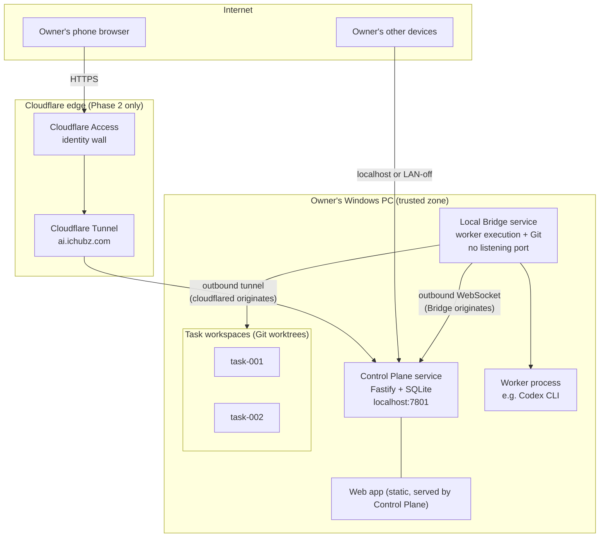
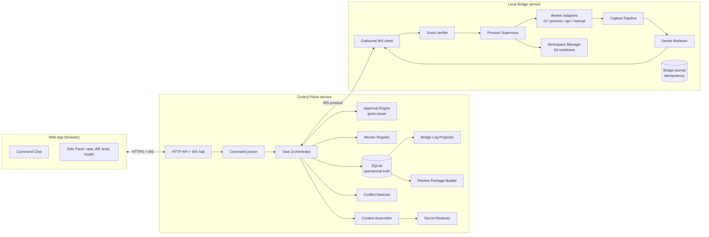
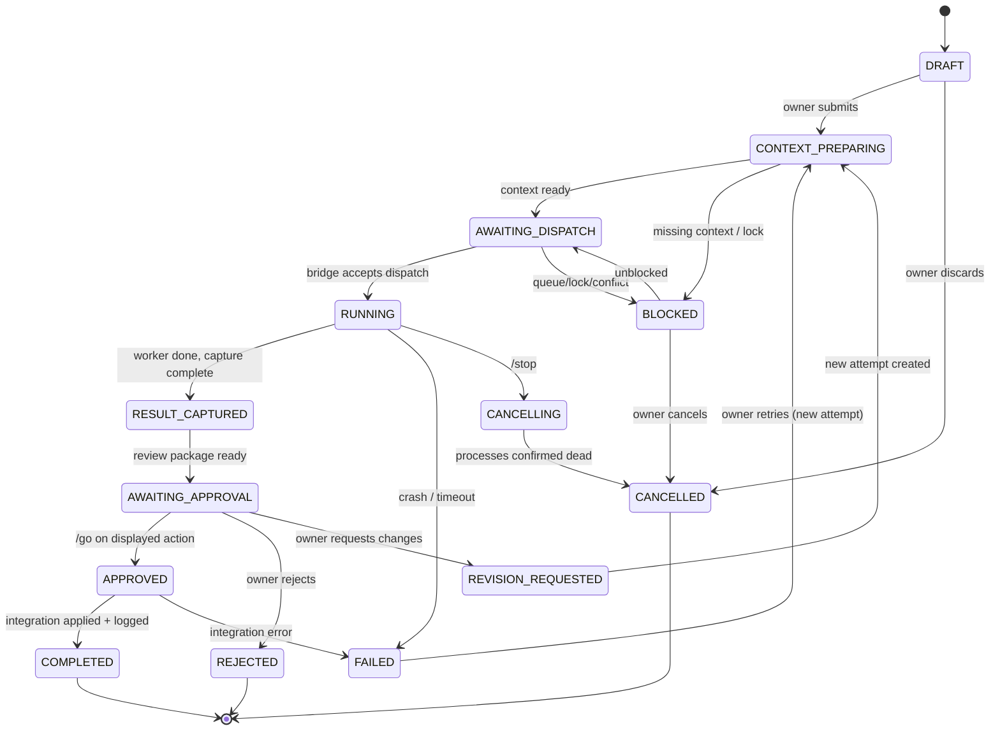
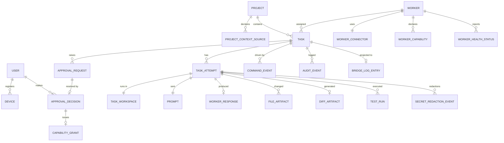

# Final Architecture Design

> **STATUS: ACCEPTED ARCHITECTURE (decisions D-006 … D-032) — M1A-M1D CONTRACTS ACCEPTED; M1E PURE CONTRACT WORK ACTIVE AND UNACCEPTED; RUNTIME NOT YET IMPLEMENTED**
>
> Author: Claude Code / BUNSO (Fable 5), lead and final designer per accepted decision D-005.
> Date: 2026-07-10. Revised following Bantay's required revisions R1–R7; accepted by Kenneth / CHUBZ the same day.
> Scope: Design only. Acceptance of this design does **not** authorize implementation, deployment, network configuration, or production access — each phase and bounded subtask carries its own explicit owner GO.

---

## 1. Executive Summary

The CHUBZ AI Command Center is designed as **two small local services on the owner's Windows PC plus one web interface**:

1. A **Control Plane** service that owns all state (SQLite), serves the chat-first web app, orchestrates tasks, enforces approval gates, and projects the Bridge Log.
2. A **Local Bridge** service that is the only component allowed to touch worker processes, project files, and Git. It connects **outbound-only** to the Control Plane and never accepts inbound network connections.

The owner uses one chat interface (browser on PC or phone). Remote access is added in a later phase through **Cloudflare Tunnel + Cloudflare Access** in front of a single subdomain, `ai.ichubz.com`. No local port is ever exposed to the internet.

Workers connect through a **manifest-driven adapter system** with four connector types (`cli-headless`, `local-process`, `http-api`, `manual-relay`). Because no worker's programmatic interface has been validated yet, **manual relay is a first-class connector**: the system prepares the bounded prompt, the owner pastes it to the worker, pastes the reply back, and the same task-state, approval, review-package, redaction, and Bridge Log workflow applies to the imported result — with honestly weaker supervision and provenance guarantees than an automated connector (§7.2). This guarantees a working system on day one for *all* workers while CLI adapters are validated one at a time.

Every consequential action passes a typed approval gate enforced by **short-lived, single-use, task-bound capability grants** checked by the Bridge. In Phase 1 these are HMAC-signed — an integrity and anti-replay control, stated honestly as *not* a proof of owner presence, since the Control Plane holds the signing key; a Bridge-verifiable passkey approval proof is a hard prerequisite before remote access (SECURITY_AND_THREAT_MODEL.md §8). The MVP deliberately refuses (does not merely gate) deployment, database, MikroTik, DNS, credential, and server-restart actions.

The MVP proves one vertical slice: one owner, one project, one bridge, one CLI connector plus manual relay, task tracking, capture, diffs, one approval gate, automatic Bridge Log, and a downloadable Bantay Review Package. M1A and M1B contract foundations are merged; M1C and all runtime work remain separately gated.

---

## 2. Design Principles

1. **Local-first** (per D-001): all state, files, and execution stay on the owner's PC. The cloud is only a doorway, never a datastore.
2. **Outbound-only trust posture**: no component on the PC listens on a public interface; connections originate from the PC outward.
3. **Gates are code, not prose**: approvals are enforced by verifiable capability grants at two layers (Control Plane and Bridge).
4. **Honest automation**: automate capture, context, diffs, and logging aggressively; never fake an integration that does not exist — degrade to manual relay visibly.
5. **The chat is the product** (per D-002): everything reachable from one conversation surface; panels support the chat, not the reverse.
6. **One source of truth per fact**: the database is operationally authoritative; Markdown (Bridge Log) and documents are projections; the worker registry manifest is authoritative for worker identity.
7. **Boring technology**: one language (TypeScript) across all packages, one embedded database, no message broker, no container orchestration. Chosen for maintainability by AI-assisted workers and understandability by a non-programmer owner.
8. **Small failure domains**: the Bridge can crash without losing task history; the Control Plane can restart without re-executing commands; a worker can hang without freezing the UI.

---

## 3. Confirmed Requirements

Drawn from the source-of-truth documents and the owner's design mission:

- Chat-first single interface with the twelve-command vocabulary (`/codex`, `/claude`, `/antigravity`, `/santos`, `/bantay`, `/compare`, `/go`, `/stop`, `/status`, `/files`, `/diff`, `/review`).
- Automatic: context loading, routing, capture of replies/files/diffs/tests, task-state tracking, conflict flagging, Bridge Log records, review packages.
- Owner (Kenneth / CHUBZ) is final GO/NO-GO authority; `/go` approves exactly one displayed bounded action.
- Three-tier gate model (read / write / deploy-operate) with separately authorized high-risk categories.
- Task isolation with bounded workspaces; overlap detection before changes combine.
- Obsidian-compatible Bridge Log without manual transcription.
- Manifest-driven worker plug-in registry (per D-004).
- Remote access from phone or computer, through controlled trust boundaries only.
- Runs on the owner's Windows 10 PC.
- No Mission-Control-style manual bookkeeping.

## 4. Assumptions and Unknowns

### Assumptions (reasonable, but flagged)

| # | Assumption | Confidence |
|---|---|---|
| A-1 | Owner's PC runs Windows 10 Pro with local admin available for service installation | High (observed) |
| A-2 | Projects to be managed are (or can become) Git repositories | Medium — **OWNER DECISION REQUIRED** for non-Git projects |
| A-3 | Owner already uses Cloudflare for `ichubz.com` DNS | Medium — affects tunnel choice |
| A-4 | Owner uses Obsidian with an existing or plannable vault location | Medium |
| A-5 | Node.js LTS can be installed on the PC | High |

### Unknowns (must be validated before or during implementation)

| # | Unknown | Impact | Validation owner |
|---|---|---|---|
| U-1 | Exact non-interactive invocation for Codex CLI on this PC | First CLI adapter | Antigravity (feasibility) |
| U-2 | Exact headless invocation for Claude Code CLI on this PC | Second CLI adapter | Antigravity |
| U-3 | Any programmatic surface for Antigravity IDE agents | Antigravity adapter tier | Antigravity |
| U-4 | Santos / Hermes runtime and invocation mechanism | Santos adapter | Owner + Santos profile update |
| U-5 | Whether Bantay review will ever be API-based (OpenAI API ≠ ChatGPT persona) | Bantay adapter tier | **OWNER DECISION REQUIRED** |
| U-6 | Cloudflare account/plan status for Tunnel + Access | Phase 2 | Owner |
| U-7 | Obsidian vault path and conventions | Bridge Log projector config | Owner |

No part of the MVP hard-depends on U-1..U-5 because manual relay covers every worker.

---

## 5. Recommended Topology `RECOMMENDED`

**Decision point (per mission): the control-plane backend is a separate local service on the owner's PC — not bundled into the web app, not cloud-hosted.**



Key properties:

- **Control Plane** binds to `127.0.0.1` only. In Phase 1 the owner browses to `http://localhost:7801`. In Phase 2, `cloudflared` (running on the same PC) makes an *outbound* connection to Cloudflare and forwards authenticated requests to that loopback port. At no point does the PC accept unsolicited inbound connections.
- **Local Bridge** has *no listening socket at all*. It dials out to the Control Plane's loopback WebSocket endpoint and authenticates with its enrollment credential. This means the same code path works later if the Control Plane ever moves off-machine (hybrid), without redesign.
- **Why separate processes on one PC** rather than one bundled service: the Bridge is the highest-risk component (it executes processes and writes files). In Phase 1, while both processes run under the same Windows user, this separation is a **strong failure and responsibility boundary** (different OS process, different credential, independently restartable, independently killable by the emergency stop) but only a **limited security boundary** — code running as the same user could interfere with either process. Privilege separation (restricted worker account, NTFS ACLs, Job Objects) is a hard prerequisite before remote access (SECURITY_AND_THREAT_MODEL.md §12, §18). The split also preserves the architecture if the owner later wants the Control Plane on a home server while the Bridge stays on the dev PC.
- **Why not cloud-hosted control plane**: violates local-first (D-001), creates a cloud datastore of prompts/diffs/audit data, adds hosting cost and a second operational environment. A **cloud relay** variant (thin stateless WebSocket relay, all state still local) is documented as the fallback if Cloudflare Tunnel proves unsuitable — see §5.1.

### 5.1 Secure remote connectivity comparison `RECOMMENDED: Cloudflare Tunnel + Access`

| Approach | Pros | Cons | Verdict |
|---|---|---|---|
| **Cloudflare Tunnel + Cloudflare Access** | Outbound-only; free tier sufficient; owner already controls domain (likely on Cloudflare, A-3); identity wall (email OTP / IdP / device posture) *before* traffic reaches the PC; normal browser URL usable from any phone | Cloudflare sees TLS-terminated traffic; dependency on one vendor; Access session management is separate from app sessions | **RECOMMENDED for Phase 2** |
| Tailscale (private overlay) | Simplest security story (no public URL at all); WireGuard; free for personal use | Every device needs the Tailscale client installed and logged in; no plain "open a URL in any browser" convenience; harder to hand a one-off review link to Bantay | **Fallback #1** — excellent if the owner accepts installing the client on the phone |
| Cloud relay (owner-run VPS, outbound WSS from PC) | Full control; no third-party inspection | Owner must operate and patch a VPS; more code (relay + auth); highest effort | Fallback #2 / future hybrid |
| Fully local only (no remote) | Zero remote attack surface | No phone access away from home | **This is Phase 1** — mandatory starting posture, not a fallback |

Trade-off summary: Cloudflare Tunnel is chosen because it satisfies "outbound-only," requires no inbound firewall change, adds an independent identity wall the app doesn't have to implement alone, and works from any browser. Its main cost — Cloudflare visibility into traffic — is acceptable for a command channel that must never carry raw credentials anyway (see SECURITY_AND_THREAT_MODEL.md §10).

---

## 6. Component Architecture



### Component responsibilities (summary — prohibited responsibilities in §13)

| Component | Owns | Never does |
|---|---|---|
| **Web app** | Rendering, command entry, approval display, diff viewing | Business logic, secrets, direct file/worker access |
| **Control Plane** | State, orchestration, gates, registry, projections, auth | Executing processes, touching project files |
| **Local Bridge** | Process execution, workspaces, Git, capture, local resource limits | Owning task state, making approval decisions, listening on a port |
| **Task Orchestrator** (in CP) | State machine transitions, dispatch, queue | Bypassing the Approval Engine |
| **Worker Adapters** (in Bridge) | Translating a dispatch into a specific worker invocation and normalizing output | Accessing files outside the task workspace |
| **Approval Engine** (in CP) | Rendering pending actions, issuing/expiring grants | Auto-approving anything |
| **Capture Pipeline** (in Bridge) | stdout/stderr, file change detection, diff generation, test result parsing | Persisting unredacted content |
| **Bridge Log Projector** (in CP) | Writing Markdown projections from DB events | Being read back as truth |
| **Review Package Builder** (in CP) | Assembling the Bantay Review Package | Including unredacted or out-of-scope files |

---

## 7. Data-Flow Descriptions

### 7.1 Happy path: owner dispatches a task to a CLI worker

1. Owner types `/codex fix the login timeout in project X` in the chat.
2. Web app sends the command with a client-generated **idempotency key** over the authenticated WebSocket.
3. Command parser validates syntax → Orchestrator creates `Task` (state `DRAFT` → `CONTEXT_PREPARING`) and a `CommandEvent`.
4. Context Assembler gathers only approved `ProjectContextSource` entries for the project, passes them through the Secret Redactor, and builds the bounded worker prompt. Task → `AWAITING_DISPATCH`.
5. Orchestrator checks queue/locks (§16), then sends a **dispatch message** to the Bridge containing: task id, attempt id, worker id, connector config reference, prompt, and a **read+workspace-write grant** scoped to the task workspace.
6. Bridge Grant Verifier checks the grant (signature, expiry, single-use, scope). Workspace Manager creates a Git worktree on branch `task/<id>` from the project's **managed clone** (§12) — never from the owner's own checkout. Process Supervisor launches the worker via its adapter with cwd pinned to the worktree. Task → `RUNNING`.
7. Capture Pipeline streams stdout/stderr (redacted) to the Control Plane; UI shows live status.
8. Worker exits (or times out per manifest). Capture Pipeline records: response text, changed files (`git status` in the worktree), unified diff (`git diff`), any test output it was configured to run. Task → `RESULT_CAPTURED` → `AWAITING_APPROVAL`.
9. Control Plane builds the approval card + review package. Owner reviews diff/tests in the side panel.
10. Owner types `/go`. Approval Engine matches it to the **single currently displayed pending action**, records an `ApprovalDecision`, and issues an **integration grant** (e.g., "finalize task/42 as an approved commit and patch in project X's managed repository"). The Bridge executes exactly that: the approved result is preserved as a task commit and exported patch in the managed workspace — **the owner's own working copy and checked-out branch are never modified**. Applying the patch to the owner's real project is a separate, explicitly displayed bounded action (§12). Task → `APPROVED` → `COMPLETED`.
11. Bridge Log Projector writes/updates the task's Markdown entry. Done — the owner never copied a file, made a diff, or edited a log.

### 7.2 Manual-relay path (same workflow after import, weaker guarantees)

Steps 1–4 identical. At step 5 the adapter type is `manual-relay`, so instead of launching a process, the system presents a **Relay Card**: the fully assembled prompt with a copy button and an upload/paste box. The owner pastes it into the worker (e.g., Bantay in ChatGPT), pastes the reply back (or uploads files the worker produced into the task workspace via the Files view). From step 8 onward the same *workflow* applies to the imported content: task states, redaction, approval records, review packages, and Bridge Log entries are produced identically. What manual relay **cannot** provide — and is never claimed to — is execution supervision, cryptographic worker identity, command capture, file provenance, cancellation, or filesystem enforcement. The result is recorded as **"owner-attested manual relay"**: the owner's attestation *is* the identity and provenance. By default a manual-relay worker's capability is **review/design/text-output only**; file changes from a manual worker enter the workspace solely through an explicit, reviewed artifact-import step.

### 7.3 `/compare`

`/compare` fans the same prepared context into N tasks (one per selected worker), each in its own worktree. When all reach `RESULT_CAPTURED`, the Control Plane renders a side-by-side card (response summaries + diff stats + file-overlap warning from the Conflict Detector). The owner approves at most one for integration; the others are `REJECTED` (worktrees archived then pruned).

### 7.4 `/stop` and emergency stop

`/stop` (or the always-visible red button) sends a cancel for the current task → task `CANCELLING`; Bridge kills the worker's whole process tree (`taskkill /T /F` semantics), marks partial capture, task → `CANCELLED`. The **emergency stop** variant additionally: revokes all outstanding grants, pauses the dispatch queue, and (hard mode) instructs the Bridge to exit its supervisor loop. See SECURITY_AND_THREAT_MODEL.md §16.

---

## 8. Worker-Adapter Architecture

### 8.1 Connector types

| Connector type | Mechanism | MVP status |
|---|---|---|
| `cli-headless` | Spawn a CLI in non-interactive mode inside the task worktree; parse stdout (prefer structured/JSON output modes) | Phase 1 (one worker) |
| `local-process` | Long-lived local process/daemon with stdio or local IPC protocol | Phase 3+ `DEFERRED` |
| `http-api` | Call a provider HTTP API with a locally stored key | Phase 3+ `DEFERRED` |
| `manual-relay` | System prepares prompt; owner transports it and attests the returned response; text-output by default, file changes only via explicit artifact import | **Phase 1 (all workers)** |
| `browser-controlled` | Automation of a worker's web UI | `DEFERRED` — high fragility and ToS risk; explicitly out of scope until owner decides |

### 8.2 Capability and connector matrix

Legend — **Confirmed**: validated on this PC. **Likely**: documented mechanism exists, not yet validated here. **Unknown**: no known stable mechanism. Every worker has manual relay as fallback.

| Worker | Likely connector | Integration status | Capabilities (planned) | Fallback |
|---|---|---|---|---|
| Codex | `cli-headless` (Codex CLI non-interactive exec mode) | **Likely — unvalidated (U-1)** | code-write, tests, review | manual-relay |
| Claude Code / BUNSO | `cli-headless` (Claude Code headless `-p` / Agent SDK) | **Likely — unvalidated (U-2)** | code-write, review, design | manual-relay |
| Antigravity (Gemini 3.1 Pro High) | none known; IDE-bound agent | **Unknown (U-3)** | ops investigation, validation | **manual-relay (primary mode)** |
| Opus inside Antigravity | same as Antigravity | **Unknown (U-3)** | assigned coding only | manual-relay |
| Santos / Hermes | unspecified in profile | **Unknown (U-4)** | specialized/backup tasks | **manual-relay (primary mode)** |
| Bantay / ChatGPT | none sanctioned for the ChatGPT app; OpenAI API is a *different* surface than the Bantay persona | **Unsupported programmatically (U-5)** | review only (never write) | **manual-relay via Review Package (primary mode)** |
| Future workers | declared in manifest | n/a | per manifest | manual-relay required in every manifest |

**Honesty note:** as of this design, no automated connector is confirmed merely by this document. Phase 0's U-1/U-2 evidence is historical; M1F defines the readiness probes that must be repeated before an adapter is enabled. Codex is the current primary implementation worker (D-027); D-019's BUNSO assignment is preserved as historical context. The system must display each worker's real connector tier in the Worker Health view — never pretend a manual worker is automated. Manual-relay workers are never represented as automatically controlled or cryptographically authenticated: their results are labeled **owner-attested** throughout the UI, capture records, and review packages, and their default capability is review/design/text output only.

### 8.3 Worker manifest schema (registry contract) `PROPOSED`

One JSON/TS-schema file per worker in the registry (seed manifests live in the shared package; DB caches them):

```
workerId, displayName, provider, runtime,
connector: { type, invocation?, healthCheck?, timeoutSec, cancelable: bool },
capabilities: [code-write | review | design | ops-validate | compare-only ...],
restrictions: [never-write | assigned-only ...],
allowedTaskCategories, defaultRiskLevel: low|medium|high,
contextLimits: { maxFiles, maxBytes },
supportedFileOps: [read | write-workspace | none],
requiredApprovals: [gate ids beyond defaults]
```

The **manifest is the authoritative worker-role source**. `docs/WORKER_ROLES.md` and README summaries become human-readable projections of it once implemented — resolving the documented duplication-drift finding. `PROPOSED — OWNER DECISION REQUIRED` (changes what document workers treat as truth).

Adding a worker = adding a manifest + (optionally) an adapter module implementing one interface:

```
prepare(task) -> invocationPlan
start(plan) -> handle          // no-op for manual-relay
streamOutput(handle) -> events
cancel(handle)
collect(handle) -> normalized result
health() -> status
```

Nothing in the core references a specific worker by name — satisfying D-004.

---

### 8.4 Adapter integration and readiness `ACCEPTED (D-024)`

Adapters are SDK/CLI-first. GUI automation is not a normal connector path and browser-controlled operation remains deferred until it has an automated-provenance design. Every adapter exposes a preferred integration and a stable fallback; manual relay is always supported and never presented as automation.

`codex exec` is the initial automated Codex path. App-server, Python SDK, and equivalent paths are experimental feature-flagged options until a probe proves their capabilities. Claude's planned backend path is the Agent SDK with API-key authentication; an embedded subscription session is not treated as a backend credential. Antigravity is capability-probed and remains secondary until its proof of concept passes.

Before dispatch is enabled, startup probes record version, capabilities, authentication state, sandbox support, noninteractive operation, cancellation, resume, structured output, and quota/rate-limit confidence when available. The registry records explicit readiness (`unprobed`, `probing`, `ready`, `degraded`, `manual-only`, `blocked`, or `frozen`) rather than a Boolean. A failed or regressed adapter falls back to manual relay and retains its evidence.

### 8.5 Recommendation-first worker routing `ACCEPTED (D-029)`

The routing engine ranks eligible workers by task type, assigned role, capability, availability, quota confidence, load, and the lowest-cost capable option. In the MVP it produces a recommendation with reasons; the owner confirms the dispatch. A future auto-dispatch policy must be explicit, revocable, and scoped to a named task category. It is never the default for production, destructive, infrastructure, credential, database, MikroTik, deployment, restart, or other operate-class work.

## 9. Command Model

Commands are parsed into typed Command objects; free text without a slash goes to the currently selected worker as a task request (after a confirmation chip showing which worker/project will receive it).

| Command | Effect | Gate |
|---|---|---|
| `/codex`, `/claude`, `/antigravity`, `/santos` | Create + dispatch task to that worker | read + workspace-write |
| `/bantay` | Create a **review** task (never write-capable) | read |
| `/compare <workers>` | Fan-out identical task (§7.3) | read + workspace-write per attempt |
| `/go` | Approve **only the single displayed pending action** | issues one grant |
| `/stop` | Cancel current task / emergency variants | none (always allowed) |
| `/status` | Show tasks, queue, workers, bridge health | none |
| `/files` | List captured/changed files for current task | none |
| `/diff` | Show current task diff | none |
| `/review` | Generate Bantay Review Package for a completed/captured task | read |

Rules:

- Every command carries a client idempotency key; replays are acknowledged, not re-executed.
- `/go` with more than one pending action is an **error** — the UI forces the owner to open a specific approval card first. `/go` never batches.
- High-risk gate categories (deploy, production, DB, MikroTik, DNS, credentials, restart, destructive Git) are **refused in the MVP** with the message "not implemented — requires future explicit design," not routed to a gate.

---

## 10. Task State Machine `ACCEPTED (D-017, clarified by D-020)`

Fourteen states (count corrected per D-020 — the original "twelve" was a counting defect; the diagram below was always the authoritative list). From the mission's candidate list, `Waiting for Worker` is merged into `RUNNING` (a display substate, not a state) and `Awaiting Review` is merged into `AWAITING_APPROVAL` (one human gate; `/review` can be invoked while in it). `Cancel Requested` is kept as the transient `CANCELLING` because process-tree kills are asynchronous.



### Transition authority (clarified by D-020 and the M1A review corrections)

Authority model: **the Control Plane records state and is the actor for system transitions; Bridge-origin facts are mandatory typed evidence, never an alternative actor.** One uncorroborated party can never satisfy a joint-authority transition — the Control Plane cannot move a task without the Bridge's evidence, and the Bridge is not a transition actor at all.

| Transition | Allowed actor | Required evidence |
|---|---|---|
| DRAFT → CONTEXT_PREPARING | Owner | — |
| CONTEXT_PREPARING → AWAITING_DISPATCH / BLOCKED | Control Plane (orchestrator) | — (BLOCKED requires a reason code) |
| AWAITING_DISPATCH → RUNNING | Control Plane | `bridge-dispatch-ack` — attempting dispatch alone never marks a task RUNNING |
| RUNNING → RESULT_CAPTURED / FAILED | Control Plane | `bridge-execution-report` |
| AWAITING_DISPATCH / RUNNING / APPROVED → CANCELLING | **Owner only** (in-flight dispatch, execution, or integration must be terminated by the Bridge) | — |
| DRAFT / CONTEXT_PREPARING / RESULT_CAPTURED / AWAITING_APPROVAL / REVISION_REQUESTED / ordinary BLOCKED → CANCELLED | **Owner only** (passive states cancel directly) | — |
| CANCELLING → CANCELLED | Control Plane | `bridge-kill-confirmation` |
| RESULT_CAPTURED → AWAITING_APPROVAL | Control Plane | — |
| AWAITING_APPROVAL → APPROVED / REJECTED / REVISION_REQUESTED | **Owner only** | — |
| APPROVED → COMPLETED / FAILED | Control Plane | `bridge-integration-report` **and** `grant-verified` |
| BLOCKED (ordinary reasons) → derived recovery target | Control Plane (auto) or Owner (override) — **never for `execution-unknown`**. The target is derived from the blocked operation (D-021): context-preparation → CONTEXT_PREPARING; worker-dispatch → AWAITING_DISPATCH; integration conflict → APPROVED (the approved stage is never discarded); uncertain worker execution has **no** ordinary recovery. There is no universal BLOCKED → AWAITING_DISPATCH | — |
| BLOCKED(execution-unknown) → stage-aware reconciliation target | **Owner only**, via a recorded reconciliation outcome (D-020/D-021). The outcome resolves the **original operation**, not the whole task: dispatch confirmed-completed → RUNNING; execution confirmed-completed → RESULT_CAPTURED; integration confirmed-completed → COMPLETED; each confirmed-failed → FAILED; each confirmed-not-executed → the operation's start state with a **new** operation (and, for execution, attempt) identity | `owner-reconciliation` plus stage evidence (e.g. `bridge-dispatch-ack`, `bridge-execution-report`, or `bridge-integration-report` + `grant-verified`) |
| FAILED/REVISION_REQUESTED → CONTEXT_PREPARING | Owner (creates new **Task Attempt**) | — |

Retries and revisions never mutate a previous attempt's captured record — each attempt is immutable once left `RUNNING`. Abandoned tasks (no owner action for a configurable period, default 14 days) are auto-moved to `BLOCKED` with a reminder; stale approvals expire (§ security doc).

`BLOCKED` carries a machine-readable **reason code** rather than spawning extra visible states: `queue-lock`, `conflict`, `missing-context`, `policy`, `abandoned`, and `execution-unknown`. `execution-unknown` is set when a privileged operation (e.g., finalizing an approved commit) was journaled as *started* but its completion cannot be proven after a crash or disconnect — the task then requires owner-reviewed reconciliation and is **never blindly retried** (§16).

**Trusted blocked context (D-021, delivery hardened by D-022):** `BLOCKED` preserves what was blocked — source state, in-flight operation (`context-preparation`, `worker-dispatch`, `worker-execution`, or `integration`), reason, attempt identity, operation identity, and (for `execution-unknown`) the trusted journal/start reference. **The current task snapshot (state, attempt identity, stored blocked context) always comes from the trusted operational store and reaches transition authorization as a separate input; the requested transition has no field capable of replacing the stored BLOCKED context** — substitution is structurally impossible, not merely validated. Contexts are cross-checked against a source/operation/reason matrix, and `execution-unknown` is legal only where an operation was recorded as started (never from context preparation).

**Execution-unknown reconciliation (D-020, stage-aware per D-021):** `BLOCKED(execution-unknown)` is not an ordinary blocked state. Ordinary unblock, re-dispatch, and even cancellation are refused for every actor — cancellation must not hide an unresolved execution outcome. The only exits are owner-only reconciliation outcomes recorded with `owner-reconciliation` evidence, and each outcome resolves the **original operation**, not automatically the whole task: **`confirmed-completed`** advances to the operation's legitimate success state (dispatch → RUNNING with the dispatch acknowledgement; execution → RESULT_CAPTURED with the execution report; integration → COMPLETED with the integration report and grant verification); **`confirmed-failed`** → FAILED, requiring **stage-specific trusted Bridge evidence in addition to owner reconciliation** (D-022: dispatch → `bridge-dispatch-failure-report`; execution → `bridge-execution-report`; integration → `bridge-integration-report` + `grant-verified`; owner reconciliation alone is never sufficient); **`confirmed-not-executed`** returns to the operation's start state (dispatch → AWAITING_DISPATCH; execution → CONTEXT_PREPARING; integration → APPROVED) with a **new operation identity** — and for execution a **new attempt identity** — never reusing the blocked one. The previous attempt remains immutable in every case, and no automated actor may reconcile.

---

## 11. Data Model `PROPOSED`

SQLite, one file, WAL mode. Conceptual entities and ownership:



| Entity | Key fields (conceptual) | Owned by |
|---|---|---|
| User | id, name, role (owner-only in MVP), authn credentials refs | Control Plane |
| Device | id, user, name, passkey/session refs, revoked_at | Control Plane |
| Project | id, name, root path, git flag, vault path, lock state | Control Plane (path validity checked by Bridge) |
| Project Context Source | id, project, type (file/dir/doc/url-note), path/ref, approved flag | Control Plane |
| Worker | id, manifest snapshot, enabled | Control Plane (from registry manifests) |
| Worker Connector | worker id, type, invocation config, timeout, cancelable | Control Plane config / Bridge executes |
| Worker Capability | worker id, capability, restrictions | Control Plane |
| Task | id, project, worker, title, category, state, created/updated | Control Plane |
| Task Attempt | id, task, seq, state timestamps, exit status, immutable after capture | Control Plane |
| Task Workspace | attempt id, worktree path, branch, base commit, disposed flag | **Bridge** (CP stores reference) |
| Prompt | attempt id, assembled prompt text (redacted), context source list | Control Plane |
| Worker Response | attempt id, normalized text, raw ref, transport (auto/manual) | Control Plane (blob on disk via artifact store) |
| File Artifact | attempt id, relative path, change type, size, hash | Control Plane index; bytes in artifact store |
| Diff Artifact | attempt id, unified diff ref, stats | same |
| Test Run | attempt id, command, exit code, summary, report ref | same |
| Approval Request | id, task, gate type, bounded action description + action hash, state, expires | Control Plane |
| Approval Decision | request id, decider, verdict, timestamp, displayed-action hash | Control Plane |
| Capability Grant | id, decision id, scope, action hash, expiry, single-use, consumed_at | Issued by CP; consumption journal also in **Bridge** |
| Command Event | id, idempotency key, raw text, parsed form, actor, result | Control Plane (append-only) |
| Audit Event | id, ts, actor, category, payload (redacted), prev-hash | Control Plane (append-only, hash-chained) |
| Bridge Log Entry | task id, file path, last projected event id | Control Plane projector |
| Secret Redaction Event | attempt id, detector, location class, count (never the secret) | Control Plane |
| Worker Health Status | worker id, ts, tier (auto/manual), reachable, last error | Control Plane (Bridge reports) |

**Artifact storage**: file blobs (responses, diffs, test reports, zipped review packages) live under a single data directory, e.g. `<data>/artifacts/<taskId>/<attempt>/...`, content-hashed, referenced from SQLite. Keeps the DB small and artifacts inspectable. The store enforces an **owner-configurable total quota** (default 10 GB, warning at 80%) and **owner-controlled retention rules** — default is keep-everything; pruning of rejected/cancelled attempt artifacts happens only through an explicit owner action, never silently.

---

## 12. Git / Workspace Isolation `RECOMMENDED`

Comparison for Windows:

| Option | Verdict |
|---|---|
| **Git worktrees** (one per task attempt, branch `task/<id>`) | **RECOMMENDED** — cheap, native diffs, real merge machinery, easy cleanup, works on NTFS |
| Git branches in the main working copy | Rejected — workers would share one directory; concurrent tasks impossible; risk to owner's uncommitted work |
| Copied workspaces | Fallback for **non-Git projects only** — expensive for large repos, no merge machinery; diffs via snapshot compare |
| Filesystem sandboxing / read-only mounts | Deferred — Windows lacks a lightweight, script-friendly equivalent of bind-mount namespaces; approximate with ACL-restricted worker account in a later phase |
| Worker-specific temp dirs | Adopted as a complement: each attempt gets a private temp dir; worker HOME/TMP env pinned to it |

Mechanics — **enrollment never touches the original project**: enrolling a Git project creates a **managed clone** under the Bridge's data directory (`<data>/repos/<project>`). The original checkout is *read* at enrollment (and on explicit owner-triggered refresh) but never written; no `git init`, hook, config change, or remote change is ever made to it silently. Worktrees `worktrees/<project>/task-<id>-a<seq>` are created from the managed clone at the approved base commit; the worker's cwd and file grant are pinned there.

On approval (Phase 1), the Bridge **finalizes the result as an approved task commit on branch `task/<id>` in the managed repository and exports a patch artifact**. It does not merge into, check out, or otherwise mutate the owner's normal working copy or its checked-out branch. **Applying** the approved patch to the owner's real project (apply / cherry-pick / export) is a separate, explicitly displayed bounded action with its own approval card, scheduled as a later milestone (PHASED_IMPLEMENTATION_PLAN.md, milestone M9); until then the owner applies exported patches manually if desired. On rejection/cancel, the worktree is archived into the review package (if wanted) and pruned. The owner's own working copy is never the worker's workspace and never an automatic write target.

Non-Git projects: enrolled by **snapshot import** into a managed workspace (the original directory is only read). `OWNER DECISION REQUIRED` — either approve initializing Git **inside the managed copy only** (recommended; proposed as a gated action — the original directory is never silently initialized or modified) or accept degraded snapshot-workspace mode (diffs via snapshot compare). Any write-back to the original directory is likewise a separate explicit bounded action.

### 12.1 Conflict handling — four distinct problems

1. **File-level overlap (pre-merge warning):** the Conflict Detector compares changed-path sets of concurrently open attempts within a project; overlap ⇒ affected tasks flagged and the later integration is `BLOCKED` until the owner sequences them. Cheap, reliable, MVP scope (trivial when concurrency = 1 per project, but the mechanism ships early).
2. **Git merge conflicts (at finalization or apply):** if the task branch no longer applies cleanly to the current managed base — or, in the later explicit apply action, to the owner's real project — the task returns to `AWAITING_APPROVAL` with a conflict report; resolution is a new task (assigned to a worker or done manually). The system never auto-resolves.
3. **Concurrent workspace conflicts:** prevented structurally — one worktree per attempt, per-project integration lock (one integration at a time).
4. **Semantic / decision conflicts:** **not automatable, and this design does not pretend otherwise.** Supported honestly by: attaching the decision log to context, prompting workers to list "assumptions made" in a structured trailer the capture pipeline stores, and surfacing assumption lists side-by-side in `/compare` and review packages for human (owner/Bantay) judgment. Phase 4 may add heuristic cross-checks; they will only ever *flag*, never decide.

---

## 13. Package and Service Boundaries

Monorepo (pnpm workspaces) — final layout `PROPOSED` (adds one package to the existing three):

| Package / service | Responsibilities | Prohibited |
|---|---|---|
| `packages/shared` | Zod schemas + TS types for every contract: task states, commands, WS protocol messages, worker manifests, grants, capture records, Bridge Log frontmatter. Pure — no I/O. | Runtime logic, network, filesystem |
| `packages/web-app` | React PWA: chat, panels, approval cards, diff viewer. Talks only to Control Plane API/WS. | Direct file access, secrets, calling providers, business rules |
| `packages/control-plane` **(new)** | HTTP/WS server, auth, orchestrator, approval engine, registry, context assembler, conflict detector, SQLite, artifact index, Bridge Log projector, review package builder | Spawning workers, writing to project directories, listening on non-loopback interfaces |
| `packages/local-bridge` | Outbound WS client, grant verification, process supervision, adapters, managed-clone/worktree management, capture, redaction (second layer), operation journal (journal-before-execution, at-most-once), emergency stop execution | Owning task state, approval decisions, any listening socket, reaching the internet except its Control Plane connection and explicitly granted worker endpoints |
| Event/audit store | Append-only tables inside the Control Plane SQLite (hash-chained) — not a separate service in MVP | Being edited in place |
| Artifact storage | Local data directory managed by Control Plane | Storing unredacted captures |
| Bridge Log projector | One-way DB → Markdown | Reading Markdown back as state |
| Notification service | `DEFERRED` (Phase 4+): push/email on approval-needed; design reserves an outbound event hook | — |

---

## 14. Capture and Review Packages

Captured automatically per attempt (all post-redaction): original owner request; assembled worker prompt; list of approved context sources used; worker response (normalized + raw ref); stdout/stderr; files created/changed/deleted (with hashes); unified diff; commands the adapter executed; test commands + results; approval requests and decisions; errors; final outcome; all timestamps; and **worker provenance** — for automated connectors: connector type, executable path, version, and executable hash when obtainable; for manual relay: the record is explicitly marked **"owner-attested manual relay"** (the owner's attestation is the provenance; no automated identity claim is made).

**Bantay Review Package** (`/review` or auto-offered at `AWAITING_APPROVAL`): a single ZIP + standalone Markdown summary containing: concise summary (what/why/risk), task metadata, prompt sent, worker response, changed-file list, unified diff/patch, test report, risk flags (gate categories touched, redaction counts, overlap warnings, assumption trailer), approval history, and optionally bounded workspace artifacts. Downloadable from the task panel; small enough to paste or attach to ChatGPT. The package is itself passed through the redactor and recorded as an artifact.

**Secret redaction (two layers, before persistence):** pattern detectors (known API-key formats, PEM/private-key blocks, connection strings, JWTs, password-like assignments), entropy heuristic for high-entropy tokens, and a **context denylist** (`.env*`, key files, credential stores are never eligible as context sources or capture content). Redactor runs in the Control Plane for outbound context and in the Bridge for captured output. Each hit becomes a Secret Redaction Event (detector + location class + count — never the value). Detail in SECURITY_AND_THREAT_MODEL.md §11.

---

## 15. Bridge Log Model `PROPOSED`

**Authority decision `PROPOSED`: SQLite is the operational source of truth; the Bridge Log is a regenerable human-readable projection.** Hand-edits to generated files are overwritten on re-projection; owner commentary belongs in separate linked notes.

- **Location:** a configurable Obsidian vault subfolder, default `<vault>/BridgeLog/` (U-7: actual vault path is owner-provided at setup).
- **Structure:** `BridgeLog/<project-slug>/YYYY/MM/` with one file per task.
- **Naming:** `YYYY-MM-DD--task-<id>--<slug>.md` (stable across re-projection).
- **Front matter:** `task_id, project, worker, state, category, created, completed, attempts, risk_flags, approval: [decision ids], links: {review_package, previous_task}`.
- **Body (concise by design — hard cap ~20 lines):** one-line request, one-line outcome, changed-file count + top files, test verdict, approval summary, wiki-links `[[project note]]`, `[[decision D-00x]]`, `[[previous task]]`.
- **Status markers:** front-matter `state` plus a single emoji-free textual badge line for Obsidian dataview queries.
- **Archival:** files are never deleted; on project archive the project folder gets an `_ARCHIVED.md` marker; monthly index note auto-generated (`_index.md` per month, list of task links).
- **Update cadence:** projected on every terminal transition plus on `AWAITING_APPROVAL` entry — not on every event, keeping the vault calm rather than becoming Mission Control.

---

## 16. Reliability, Recovery, Concurrency

### Failure behaviors

| Failure | Behavior |
|---|---|
| PC offline / Control Plane down | Remote UI unreachable (Cloudflare returns error page); no queued cloud state exists to replay wrongly; on restart CP reconciles DB vs Bridge journal |
| Internet/tunnel interruption | Local use unaffected (loopback); remote sessions resume after reconnect; WS clients resync via `last_event_id` cursor |
| Bridge disconnect | CP marks bridge offline; RUNNING tasks stay RUNNING with "bridge offline" badge; Bridge keeps supervising locally and journals results; on reconnect it replays unacked results |
| Worker timeout | Adapter enforces manifest `timeoutSec`; process tree killed; attempt → FAILED with partial capture flagged `partial: true` |
| Worker crash | Same as timeout, with exit code recorded |
| Duplicate command delivery | **At-most-once design**: idempotency keys on every command (a replay receives the original result, not re-execution); the Bridge **journals every privileged operation before starting it** and **consumes the grant before privileged execution**, so a re-delivered dispatch or reused grant is refused. Operations move through explicit journal states `prepared → started → completed / failed / execution-unknown` |
| Stale approval | Approval requests expire (default 30 min) → back to AWAITING_APPROVAL with "expired, re-request" notice; grants expire in ≤10 min and are single-use |
| Abandoned task | Auto-BLOCKED after 14 days idle, surfaced in `/status` |
| System restart / crash mid-operation | CP: SQLite WAL recovery + journal reconciliation; Bridge: on start, kills orphaned worker processes and reconciles its operation journal. An operation journaled `started` but not `completed` is **never blindly retried**: for Git operations the Bridge reconciles against actual repository state (does the expected commit/branch exist and match?) and either marks it `completed` or sets the task `BLOCKED(execution-unknown)` for owner-reviewed resolution |

### Integrity, tracing, and recovery tests `ACCEPTED (D-025/D-026)`

The trace model is OpenTelemetry-compatible. A trace links the task, attempt, operation, adapter run, worker process, approval, artifacts, and recovery or failure event; raw worker text is never that authority. Quota observations carry source and confidence, not a fabricated precise value. Rate limits trip a circuit breaker; authentication expiry, regression, or manual owner action can freeze an adapter or runtime.

Runtimes are version-pinned and hash-verified where practical. Upgrades use a staged canary, repeat capability probes, and a rollback path. The resilience suite covers duplicate dispatch and events, bridge/worker crashes, stale lease, expired approval, malformed structured output, authentication expiry, cancellation during execution, resume after interruption, rate limits, partial artifacts, and operation-journal reconciliation. SQLite in WAL mode plus the operation journal remains the MVP durability model; a durable workflow engine is deferred until evidence of need.

### Concurrency and resource control `RECOMMENDED`

- **MVP limits:** max **1 RUNNING task per project**, max **2 RUNNING system-wide**; FIFO queue with owner reordering; excess dispatches wait in `AWAITING_DISPATCH`.
- **Locks:** per-project integration lock (one merge at a time); per-project dispatch lock while concurrency = 1.
- **Resources:** per-attempt timeout (manifest), process-tree kill on cancel/timeout, max captured-output size (truncate + flag), max workspace disk quota (soft check before dispatch), artifact-store quota + retention (§11). Reliable process-tree containment via Job Objects and the restricted worker account are a **prerequisite before Phase 2 remote access** (SECURITY_AND_THREAT_MODEL.md §12); CPU/memory *quota tuning* on top of that is Phase 4.
- **UI states per worker:** `ready`, `busy (task N)`, `queued (n waiting)`, `blocked`, `offline`, `manual` — shown as chips in the worker selector and health view.

---

## 17. Recommended Technology Stack `RECOMMENDED — OWNER DECISION REQUIRED`

One language (TypeScript) everywhere; every choice has a fallback.

| Area | Recommended | Why it fits | Main drawbacks | Fallback |
|---|---|---|---|---|
| Frontend | **React 18 + TypeScript + Vite**, Tailwind CSS | Largest AI-worker familiarity (fewest implementation errors), huge ecosystem for chat/diff components, Vite is simple on Windows | More boilerplate than Svelte; bundle size | SvelteKit |
| Backend / control plane | **Node.js LTS + Fastify + TypeScript** | Same language as everything else; Fastify has first-class schema validation + WebSocket plugin; light footprint | Single-threaded CPU limits (fine — orchestration is I/O-bound) | Hono (or Express) |
| Local bridge runtime | **Node.js LTS + TypeScript** (`execa` for processes) | Shares `packages/shared` types directly; adequate process control on Windows | Process sandboxing weaker than a compiled agent | Go single-binary bridge (stronger isolation, more effort) |
| Database | **SQLite (WAL) via `better-sqlite3`** | Local-first, zero administration, safe online backups via the SQLite backup mechanism (`VACUUM INTO` / backup API — never by copying the main file while WAL is active), more than enough scale for one owner | Concurrent-writer limits (irrelevant at this scale) | PostgreSQL (only if multi-user future arrives) |
| Real-time transport | **WebSocket** (`@fastify/websocket`), event-cursor resync | Bidirectional (bridge protocol needs it), works through Cloudflare Tunnel | Reconnect logic must be written carefully | SSE (UI-only) + HTTP polling |
| Task queue | **SQLite-backed in-process queue** in the Control Plane | No broker to install/operate; queue state survives restart; transactional with task state | No distributed workers (not needed) | BullMQ + Redis (only if ever distributed) |
| Local process execution | **`execa` + explicit process-tree kill (`taskkill /T`)**, per-attempt cwd/env pinning | Proven Windows behavior; streams stdout/stderr | Not a security sandbox by itself (see threat model) | Node `child_process` direct |
| Schema validation | **Zod** (single source in `packages/shared`) | Runtime validation + inferred TS types from one definition; every message/manifest validated at boundaries | Slight runtime cost | TypeBox |
| Authentication | **@simplewebauthn (passkeys) + Argon2 password fallback + secure session cookies**; Cloudflare Access as outer wall in Phase 2 | Phishing-resistant, phone-friendly (Face/fingerprint), no third-party auth SaaS holding owner credentials | WebAuthn setup complexity; requires HTTPS origin (fine via tunnel; localhost is a secure context) | TOTP-based 2FA |
| Tunnel / private networking | **Cloudflare Tunnel + Cloudflare Access** | See §5.1 | Vendor visibility/dependency | Tailscale |
| Artifact storage | **Local filesystem data directory, content-hashed, indexed in SQLite** | Simple, inspectable, easy backup | No offsite copy by itself (backup is owner's existing routine + documented restore) | S3-compatible (e.g., R2) later |
| Logging | **pino** (JSON) → rotating files; audit events hash-chained in SQLite | Structured, fast, greppable; audit separated from debug logs | Log files need rotation config | winston |
| Testing | **Vitest** (unit/contract) + **Playwright** (UI E2E) | Native TS, fast; Playwright covers the chat flows | E2E maintenance cost | Jest + Cypress |
| Windows packaging / service | Phase 1: run via `pnpm` scripts in two terminals. Phase 2+: **NSSM** (services) or **Task Scheduler** auto-start | Zero-effort start for MVP; NSSM is the boring standard for Node-as-Windows-service | NSSM is an extra binary to install | node-windows |
| Mobile / PWA | **PWA manifest + service worker** on the web app | One codebase; installable on the owner's phone from `ai.ichubz.com`. Service worker uses versioned caching for **static frontend assets only** and network-only behavior for all control traffic — it must never cache `/api/*`, `/ws`, auth/session responses, approval cards or actions, task state, diffs, or artifact/review-package downloads (SECURITY_AND_THREAT_MODEL.md §14.1) | No native push on iOS below recent versions | Responsive web only |

Explicitly avoided: Kubernetes/Docker orchestration, message brokers, microservices, GraphQL, separate auth SaaS, Electron. None materially helps a one-owner local system.

---

## 18. UI / UX Structure

Layout: **a primary command chat plus task and observability surfaces.** Chat remains the primary command and approval surface; Kanban, task queue/detail, worker and quota status, recovery center, logs, and dashboard views expose the same underlying state without creating a second command path.

**Top bar:** project selector (dropdown; remembers last), worker selector with status chips, **Emergency Stop button (always visible, red, requires one confirm tap)**, connection indicator (local / remote via tunnel / bridge offline).

**Main Command Chat contains:** owner commands and free-text requests; concise worker responses (long output collapsed behind "expand"); task-state transitions as compact system lines ("Task 42 → running"); **Approval Cards** — inline, showing the exact bounded action, gate type, diff stats, test verdict, expiry countdown, and `/go` / Reject / Request-revision buttons; **Relay Cards** for manual-relay workers (copy prompt / paste response, labeled owner-attested); `/compare` result cards. Worker responses and diffs are rendered through a sanitizing Markdown/text pipeline — never as executable HTML (SECURITY_AND_THREAT_MODEL.md §14.1).

**Side panel (collapsible, tabs — hidden by default on phone):**

| Tab | Contents |
|---|---|
| Task | Current task detail: state timeline, attempt list, prompt used, context sources |
| Files & Diff | Changed-file tree + unified diff viewer (this is where `/files` and `/diff` deep-link) |
| Tests | Test runs, exit codes, report text |
| History | Task history list with filters; links to Bridge Log entries and review packages (Download Bantay Review Package lives here and on each approval card) |
| Workers | Health view: connector tier (automated vs manual — honestly labeled), reachability, last error, queue |
| Settings | Project paths, context sources, vault path, devices & sessions (revocation), bridge enrollment |
| Kanban & Queue | Task queue, board, ownership, and explicit handoff status |
| Dashboard | Worker, quota, artifact, recovery, and system-status summaries |
| Recovery & Logs | Journal reconciliation, failure timeline, and redacted operational logs |

Rule of placement: **anything the owner must act on appears in the chat; anything the owner may inspect lives in the panel.** The chat never fills with raw logs, full diffs, or file dumps — those are one tap away in the panel. This is the structural guarantee against Mission-Control drift.

**Action invariant (D-028):** an action initiated from any non-chat surface emits the same typed command and passes through the same approval and policy engine as chat. Dashboards and boards never receive a weaker or separate command path.

Phone (PWA): single column; panel becomes a bottom sheet; approval cards and emergency stop keep first-class prominence.

---

## 19. Domain / Subdomain Recommendation `RECOMMENDED`

| Subdomain | Verdict | Reason |
|---|---|---|
| `ai.ichubz.com` | **MVP (Phase 2)** — the only subdomain needed | Single tunnel hostname to the Control Plane; app, API (`/api`), and WS (`/ws`) are same-origin — simpler auth, no CORS |
| `api.ichubz.com` | `DEFERRED` | Same-origin API removes the need; revisit only if third-party integrations ever need a separate API surface |
| `bridge.ichubz.com` | `DEFERRED` (likely never) | The Bridge is outbound-only by design; an inbound bridge hostname would contradict the security model |
| `auth.ichubz.com` | `DEFERRED` | Cloudflare Access hosts its login on its own domain; in-app passkeys are same-origin |
| `files.ichubz.com` | `DEFERRED` | Artifacts are served through the authenticated app; a separate file host would bypass its gates |
| `docs.ichubz.com` | `DEFERRED` | Docs live in the repo/vault for now |
| `status.ichubz.com` | `DEFERRED` | A public status page is Phase 5 polish at most |

No DNS, tunnel, certificate, or hosting configuration is performed or implied by this recommendation.

---

## 20. MVP Scope

**In:** one owner; one project; one Windows PC bridge; **one CLI connector (Codex CLI, pending U-1 validation) + the manual-relay connector (all workers)**; chat command submission (all twelve commands, with `/compare` limited to two workers); task state machine; response/stdout capture; changed-file + diff capture; single manual approval gate with capability grants; automatic Bridge Log; Bantay Review Package download; emergency stop; local-only access (Phase 1) then Cloudflare-gated remote (Phase 2).

**Out (MVP):** deploy/operate gate execution, database operations, MikroTik/router actions, DNS/tunnel changes by the system, server restarts, credential access, destructive Git operations (force-push, history rewrite — refused), multi-owner roles, notification service, browser-controlled workers, CPU/memory quota tuning (privilege containment itself is a Phase 2 prerequisite, not an MVP feature), semantic-conflict heuristics, ISP billing / PisoWiFi / payroll / solar / EV / CCTV or any business-system control (extension points reserved via the gate categories and worker registry, nothing more).

## 21. Explicit Non-Goals

- Not a general multi-tenant SaaS; one owner household by design.
- Not an autonomous agent swarm: no worker triggers another worker without an owner-visible task and gate.
- Not a replacement for the owner's judgment: `/compare` and review packages inform a human decision; the system never merges on its own initiative.
- Not a business-operations controller (MikroTik, billing, etc.) in any current phase.
- No native mobile apps; PWA only.
- Semantic conflict *resolution* is permanently out of scope; only flagging is planned.

---

## 22. Architecture Decisions — Owner Verdicts Recorded

> **UPDATE (2026-07-10): all proposals below were ACCEPTED BY OWNER and recorded as decisions D-006 … D-018 in [DECISIONS.md](DECISIONS.md), which now governs.** The `RECOMMENDED` / `PROPOSED` / `OWNER DECISION REQUIRED` labels in the table are preserved as a historical record of how each item was presented before acceptance; they no longer indicate pending status. The owner additionally promoted D-001 … D-004 to accepted and added D-019 (temporary implementation-worker assignment). D-005 is untouched.

| Proposed ID (now D-00x) | Decision | Label as originally presented |
|---|---|---|
| P-006 | Topology: local Control Plane + separate outbound-only Local Bridge on the owner's PC; web app served by Control Plane (§5) | `OWNER DECISION REQUIRED` |
| P-007 | Technology stack per §17 (TypeScript / React / Fastify / SQLite / Zod / WebSocket / pnpm monorepo) | `OWNER DECISION REQUIRED` |
| P-008 | Remote access via Cloudflare Tunnel + Cloudflare Access on `ai.ichubz.com` only; all other subdomains deferred (§5.1, §19) | `OWNER DECISION REQUIRED` |
| P-009 | Managed-clone enrollment + Git worktrees as the task-isolation substrate; approved results finalize as commits + patches in the managed repository, never by writing to the owner's working copy; applying to the real project is a separate gated action; non-Git projects enroll by snapshot import (§12) | `OWNER DECISION REQUIRED` |
| P-010 | SQLite is the operational source of truth; Bridge Log Markdown is a regenerable projection (§15) | `OWNER DECISION REQUIRED` |
| P-011 | Worker registry manifests become the authoritative worker-role definition; prose docs become projections (§8.3) | `OWNER DECISION REQUIRED` |
| P-012 | Manual relay is a first-class connector and the universal fallback — recorded as **owner-attested**, default capability review/design/text-output only, file changes via explicit artifact import; connector tier always displayed honestly (§8) | `RECOMMENDED` |
| P-013 | First automated connector target: Codex CLI, pending U-1 validation by Antigravity | `PROPOSED` |
| P-014 | Approval enforcement via short-lived single-use capability grants — Phase 1: HMAC-signed (integrity/anti-replay control only, honestly not owner-presence proof since the Control Plane holds the key); before Phase 2 remote access: Bridge-verifiable passkey (WebAuthn) approval proof the Control Plane cannot forge (security doc §8) | `RECOMMENDED` |
| P-015 | High-risk gate categories (deploy, production, DB, MikroTik, DNS, credentials, restart, destructive Git) are refused entirely in MVP, not merely gated | `RECOMMENDED` |
| P-016 | MVP concurrency: 1 running task per project, 2 system-wide (§16) | `RECOMMENDED` |
| P-017 | Task state machine per §10 (12 states) | `PROPOSED` |
| P-018 | Add `packages/control-plane` as the fourth workspace package (§13) | `PROPOSED` |

---

*Companion documents: [SECURITY_AND_THREAT_MODEL.md](SECURITY_AND_THREAT_MODEL.md), [PHASED_IMPLEMENTATION_PLAN.md](PHASED_IMPLEMENTATION_PLAN.md). Reviewed historical BUNSO inputs: [Overall Architecture Draft](architecture/CHUBZ_AI_COMMAND_CENTER_OVERALL_ARCHITECTURE_DRAFT.md), [Gap and Decision Review](architecture/OVERALL_ARCHITECTURE_GAP_AND_DECISION_REVIEW.md), and [Experiment Adoption Plan](architecture/BUNSO_EXPERIMENT_ADOPTION_PLAN.md); their disposition record is [BUNSO Architecture Alignment](architecture/BUNSO_ARCHITECTURE_ALIGNMENT.md). The custom Control Plane / Local Bridge architecture remains governing; experimental code is never a replacement or blind cherry-pick source.*
