# Security and Threat Model

> **M11 candidate security boundary (2026-07-23):** Runtime configuration is strict, loopback-only, secret-reference-only, path-contained, and link/reparse-point rejecting. The Windows bundle is staged atomically below `B:\AI_Agent_folder`, rejects unsafe entries, and is SHA-256 verified. PID records bind PID, executable, command digest, start time, and configuration digest; shutdown refuses stale or mismatched identities. Support evidence is bounded, sanitized, immutable, and hash-verified. The packaged Bridge still initiates the only Bridge connection and has no inbound listener. No install, service, registry, firewall, remote-access, automatic upgrade/rollback, push, or deployment authority exists. See [M11_OPERATIONS_PACKAGING_RELEASE.md](M11_OPERATIONS_PACKAGING_RELEASE.md).

> **M9 candidate security boundary (2026-07-23):** Only complete integrity-verified M7 evidence for one exact reviewed commit is eligible. The outbound-only Bridge prepares in a canonical isolated worktree, rejects unsafe Git configuration/links/paths and checked-out target refs, runs only predeclared bounded validation, and promotes only through an owner-confirmed compare-and-swap ref update. Conflicts, stale refs, emergency stop, validation failure, and unknown outcomes fail closed. Owner working copies, push, deployment, force operations, automatic rollback, and M10+ behavior remain outside authority. See [M9_SAFE_APPLY_AND_PROMOTION.md](M9_SAFE_APPLY_AND_PROMOTION.md).

> **M8 candidate clarification (2026-07-23):** Web emergency-stop activation and release require the authenticated sole administrator, strict Origin, CSRF, idempotency, owner/project binding, and current scope version. “Owner-initiated and never approval-gated” below means no worker grant is required; it does not mean unauthenticated. Activation persists before it is authoritative, fails closed when the Bridge is unavailable, revokes unconsumed queued authority, and requests cancellation without claiming success. The outbound-only Bridge serializes its final pre-spawn check with stop activation. Release is explicit and never auto-resumes work.

> **CURRENT IMPLEMENTATION STATUS:** M1A-M10 accepted; bounded local-only M11 operations/packaging candidate active and unaccepted; M12+ unauthorized.
>
> **Historical architecture status (2026-07-10 through D-027):** contract foundations only; runtime was not yet implemented.
>
> Author: Claude Code / BUNSO (Fable 5), per accepted decision D-005.
> Date: 2026-07-10. Revised following Bantay's required revisions R1–R7.
> Companion to [FINAL_ARCHITECTURE_DESIGN.md](FINAL_ARCHITECTURE_DESIGN.md). Design only — no configuration, deployment, or operational action is authorized by this document. The §18 pre-remote-access checklist remains a hard gate requiring its own owner GO.

---

## 1. Assets to Protect

Ordered by consequence of compromise:

1. **The owner's PC itself** — arbitrary code execution on it is total compromise (it also reaches the home network, MikroTik gear, and other business systems).
2. **Owner authentication credentials** (passkeys, sessions, Cloudflare Access identity) — grant remote command authority.
3. **Bridge enrollment credential and grant-signing key** — forging either defeats the approval system.
4. **Project source code and files** on disk.
5. **Provider secrets** (worker CLI logins/API keys held by tools like Codex/Claude CLIs).
6. **Captured history** (prompts, responses, diffs, audit log) — sensitive business context; also integrity matters (audit must be tamper-evident).
7. **The `ichubz.com` domain/Cloudflare account** (Phase 2) — controls the front door.
8. **Availability** of the command center (lowest priority; it controls nothing life-critical and the MVP has no production authority to lose).

## 2. Trust Boundaries

```mermaid
flowchart LR
    B1[Internet / owner's browser] -->|TB-1: Cloudflare Access identity wall| B2[Cloudflare edge]
    B2 -->|TB-2: outbound tunnel to loopback| B3[Control Plane]
    B3 -->|TB-3: authenticated bridge WS + grants| B4[Local Bridge]
    B4 -->|TB-4: process + workspace boundary| B5[Worker process]
    B5 -->|TB-5: worktree scope| B6[Project files / rest of PC]
```



- **TB-1** Internet → Cloudflare Access: only the owner's authenticated identity passes (Phase 2). In Phase 1 this boundary is "loopback only" — nothing crosses it.
- **TB-2** Cloudflare → Control Plane: `cloudflared` originates outbound; Control Plane listens on `127.0.0.1` only and additionally validates its own session — Cloudflare Access is a wall, not the only wall.
- **TB-3** Control Plane → Bridge: mutual authentication (bridge enrollment credential + server identity pinning); every privileged instruction must carry a valid capability grant.
- **TB-4** Bridge → worker process: supervised child process; pinned cwd/env; timeout; tree-kill; vendor sandbox where capability-proven. *Not* a strong sandbox in MVP — see Residual Risks.
- **TB-5** Worker → filesystem/network: worker is restricted to its worktree and explicit filesystem roots; network is default-deny where practical and enabled only by task-scoped grant. MVP enforcement remains supervision + post-hoc detection until the restricted worker account is in place.

**The web app is untrusted display code.** It holds no secrets, signs nothing, and every command it sends is re-validated by the Control Plane.

## 3. Threat Actors

| Actor | Capability | Interest |
|---|---|---|
| Internet opportunist / scanner | Mass exploitation of exposed ports and login pages | Any foothold |
| Targeted remote attacker | Phishing the owner, credential stuffing, tunnel/domain account takeover | Control of the PC / business systems |
| Malicious or compromised worker output | Prompt-injected or hostile model output: harmful code, instructions embedded in context, attempts to widen scope | Escaping the workspace, exfiltrating secrets, poisoning approvals |
| Compromised dependency (supply chain) | Malicious npm package executing inside CP or Bridge | Same as above, with high privilege |
| Person with physical/local access to the PC | Full local control | Everything |
| The owner (error, not malice) | Fatigued approvals, mis-typed commands | Accidental damage |

## 4. Main Attack Paths and Mitigations

| # | Path | Mitigations |
|---|---|---|
| AP-1 | Internet → exposed port on PC | **Eliminated structurally**: no inbound listener; loopback binding; outbound-only tunnel and bridge |
| AP-2 | Internet → stolen owner session → remote commands | Cloudflare Access + in-app passkey (two independent walls), short sessions, device revocation, every consequential action still requires a fresh in-app approval, full audit |
| AP-3 | Worker output injects instructions ("also run this command / approve this") | Workers never talk to the gate: approval cards render only Control-Plane-derived facts (diff stats, file lists), never worker-authored action text; grants are owner-initiated only; worker text is displayed as inert content |
| AP-4 | Worker writes outside its workspace | cwd/env pinning, workspace-scoped grant, changed-path capture compared against scope (out-of-scope writes flag the task and block integration), later: restricted worker OS account |
| AP-5 | Malicious code merged after weak review | Diff always shown before `/go`; tests surfaced; risk flags (files touched outside declared intent, new network/exec calls flagged by heuristic lint in Phase 4); Bantay Review Package for second opinion; owner remains the gate |
| AP-6 | Secret leakage into prompts/logs/review packages | Context denylist + dual-layer redaction + redaction events (§11); provider secrets never enter the data path at all |
| AP-7 | Forged approvals / replayed grants | Single-use, ≤10-min, action-hash-bound grants with a bridge-side consumption journal and ±2 min skew tolerance (§8). Phase 1 HMAC blocks replay and tampering by anything *without* the signing key — but the Control Plane holds that key, so this is not protection against Control Plane compromise; the Phase 2 passkey approval proof (§8.2) closes that gap before remote exposure |
| AP-8 | Supply-chain compromise of a dependency | Lockfile-pinned versions, minimal dependency set, `pnpm audit` in CI, no postinstall scripts where avoidable, dependency review as an explicit implementation-phase checklist item |
| AP-9 | Cloudflare account takeover | Owner account hardening prerequisite (MFA on Cloudflare) before Phase 2 go-live; in-app auth remains a second wall even if the edge falls |
| AP-10 | Duplicate/replayed remote commands after reconnect | **At-most-once design**: idempotency keys end-to-end; the Bridge journals privileged operations before execution and consumes grants before privileged execution; a replay receives the original result; ambiguous outcomes become `execution-unknown` for owner-reviewed reconciliation, never blind retry (design doc §16) |
| AP-11 | Runtime drift, expired adapter authentication, or provider rate limit | Version pinning and hash verification where practical; startup capability probes; quota-confidence labels; rate-limit circuit breakers; staged canaries, rollback, and owner/automatic freeze switches (D-025) |

## 5. Web-to-Local-Bridge Risks (the critical chain)

The chain Browser → Control Plane → Bridge → process execution is the reason this system needs a threat model. Controls in sequence:

1. Browser input is data, never code: strict schema validation (Zod) on every message; commands are an enum, not free-form shell.
   Every chat, Kanban, queue, dashboard, recovery, and log action reaches this same typed-command boundary; no alternate UI command path exists.
2. Control Plane authorizes: session validity, project scope, task state legality, gate policy — before anything reaches the Bridge.
3. The Bridge trusts no instruction on connection identity alone: privileged operations (dispatch, integrate, delete workspace, kill) each require a matching grant. **Honest limitation:** in Phase 1 the Control Plane itself holds the HMAC signing key, so a fully compromised Control Plane could mint valid-looking grants. Phase 1 grants defend against replay, accidental protocol misuse, stale messages, scope mismatch, and duplicated delivery — **not** against full Control Plane compromise. That is acceptable only while the whole system is loopback-only; before any remote exposure, consequential approvals must carry a Bridge-verifiable owner-presence proof the Control Plane cannot forge (§8.2).
4. Worker invocations are parameterized: adapters build argument arrays (`execa` without shell), never string-concatenated shell commands; owner text is passed as prompt content, not as command-line-interpreted material.
5. Everything is journaled on both sides for post-incident reconstruction.

## 6. Authentication Model

| Layer | Phase 1 (local only) | Phase 2 (remote) |
|---|---|---|
| Network reachability | Loopback only | Cloudflare Access (email OTP or IdP; owner-only policy) in front of the tunnel |
| Application login | Owner password (Argon2id) on `http://localhost` | **Passkey (WebAuthn)** primary; password+TOTP fallback |
| Session | HttpOnly, Secure, SameSite=Strict cookie; idle timeout 24 h local | Idle timeout 2 h remote; absolute lifetime 14 days; re-auth (passkey tap) required for gate decisions on remote sessions |
| WebSocket auth | Session cookie validated at upgrade + per-connection nonce token; server closes on session revocation | Same |
| Device management | Device record per registered browser; owner can list and revoke; revocation kills sessions and WS immediately | Same, plus new-device registration requires an existing authenticated session or physical access to the PC |
| Future staff roles | Data model has `role`; MVP hardcodes owner-only. Role checks are written at every gate from day one so adding roles later is additive, not a rewrite | `DEFERRED` |

All authentication events (success, failure, revocation, new device) are audit events. Raw provider secrets are never sent to or stored in the browser.

## 7. Bridge Identity

- Enrollment: on first setup, the owner (locally, physically at the PC) runs a bridge enroll step; the Control Plane issues a one-time enrollment code, exchanged for a long-lived **bridge credential** (random 256-bit token or keypair).
- Storage: bridge credential and the Control Plane's grant-signing key are stored via **Windows DPAPI** (user-scoped encryption), never in plaintext config or the repo.
- Connection: bridge authenticates every WS connection with its credential; Control Plane pins the expected bridge id; a second bridge cannot enroll without a new owner-initiated enrollment.
- Rotation: credentials rotatable from Settings; rotation revokes the old immediately.

## 8. Authorization and Capability Grants

### 8.1 Phase 1 (local-only): HMAC grants — integrity and anti-replay, not owner-presence proof

The Phase 1 enforcement primitive for every consequential action:

```
grant = {
  grantId, approvalDecisionId, taskId, attemptId,
  gate: read | write-workspace | integrate | dispose | ...,
  actionHash: SHA-256 of the canonical bounded-action description
              (exactly what was displayed on the approval card),
  scope: { projectId, workspacePath | branch | artifact ids },
  issuedAt, expiresAt (≤ 10 min), singleUse: true
}
signature = HMAC-SHA-256(controlPlaneSigningKey, canonical(grant))
```

Bridge verification (all must pass): signature; expiry (±2 min skew tolerance); grant not in consumed journal — **consumption is atomically journaled before privileged execution begins**; requested operation's own canonical hash equals `actionHash`; scope containment (paths inside the named workspace).

**What Phase 1 HMAC grants protect against:** replayed or duplicated delivery, stale/expired instructions, scope mismatch, accidental protocol misuse, and tampering by any party that lacks the signing key. A generic `/go` cannot leak authority because the grant encodes the exact displayed action — approving "finalize task/42" cannot be replayed as "delete workspace" or reused tomorrow.

**What they do not protect against — stated plainly:** the Control Plane possesses the signing key, so a fully compromised Control Plane could forge valid grants. The Phase 1 HMAC design is therefore **not an independent proof of owner approval** and must never be described as such. This residual risk (R-8) is accepted *only* because Phase 1 is loopback-only with no remote surface.

### 8.2 Required before Phase 2 remote access: Bridge-verifiable owner-presence approval proof

Before remote access is enabled, consequential approvals must be verifiable by the Bridge **without trusting the Control Plane**:

1. For each approval request, the **Bridge issues (or contributes to) a one-time nonce** and records it in its journal.
2. The approval challenge cryptographically binds: the canonical **action hash**, **task id**, **attempt id**, **scope**, **expiry**, and the **Bridge nonce**.
3. The owner approves with a **passkey / WebAuthn assertion** over that challenge (the login passkey or a dedicated approval passkey).
4. The **Bridge independently verifies** the assertion using: the registered owner credential's **public key** (enrolled directly with the Bridge at setup, like the bridge credential itself), the expected **RP ID / origin data**, the challenge contents (nonce, action hash, task/attempt/scope, expiry), and its **replay journal** (nonce single-use, signature-counter checks where available).
5. The Control Plane merely transports the assertion; it **possesses no private key that can forge owner approval**. A compromised Control Plane can at worst deny service or render a misleading approval card — and card mismatch is caught because the Bridge verifies the assertion against the *actual requested operation's* canonical hash, so an approval harvested for a displayed action cannot authorize a different real action.

**Fallback option `PROPOSED` — separate approval-signer service:** a minimal dedicated process holding its own signing key that presents actions to the owner out-of-band and countersigns approvals. Its costs, stated honestly: a second high-value key to protect and rotate; another always-on process to operate, patch, and monitor; an availability dependency on the approval path; and unless it has its own trusted input/display path, it *shifts* rather than removes the trust problem. The WebAuthn approach is preferred because the approval private key lives in the owner's authenticator hardware, not in any service on the PC.

### 8.3 Common properties

All grants remain **task-bound, action-bound, time-bound, and single-use** in every phase. Routine automatic operations (creating a worktree for an owner-dispatched task, capturing output) use system-issued grants tied to the dispatch itself, so even "automatic" bridge work follows the same verified format — with the same Phase 1 limitation acknowledged until §8.2 is in place.

## 9. Approval Enforcement per Gate

| Gate / category | MVP enforcement |
|---|---|
| Read (context loading, status) | Allowed within declared project context sources only; denylist paths excluded; all loads recorded |
| Write (workspace) | Auto-granted per dispatch, **scoped to the task worktree only** |
| Test/build execution | Runs inside the worktree under the dispatch grant, subject to timeout and output caps; commands recorded |
| Integrate (finalize approved commit + patch in the *managed* repository) | Requires explicit `/go` on a displayed card → integration grant; never writes to the owner's own working copy. The later explicit **apply-to-project** action has its own card and its own grant |
| Deploy / operate | **REFUSED in MVP** (P-015): not routed to a gate; the command errors with "not implemented" |
| Production actions, database ops, MikroTik/router, DNS/tunnel changes, server restart, credential access | **REFUSED in MVP**, same mechanism. Future design must give each its own gate type, its own approval card wording, and a typed confirmation phrase distinct from `/go` |
| Destructive Git (force-push, history rewrite, branch deletion outside task branches) | **REFUSED** — adapters and the bridge's Git layer have no code path for them |
| Emergency stop | Never gated; always allowed; cannot be disabled remotely |

A general `/go` therefore *cannot* silently authorize deployment, production writes, database writes, MikroTik actions, DNS changes, credential access, server restarts, or unrelated future actions — those actions have no executable path in the MVP at all, and post-MVP each gets a distinct grant type that `/go` does not issue.

## 10. Secret Storage

- System secrets (bridge credential, signing key, session keys): Windows DPAPI, user scope, on the PC only.
- Provider secrets (worker CLI logins, API keys): remain wherever the worker tool stores them; **the command center never reads, stores, transports, or proxies them.** Adapters invoke tools that are already authenticated on the PC.
- Nothing secret in: the browser, SQLite, artifacts, Bridge Log, review packages, or the repo. `.env` files are prohibited by mission restriction and unnecessary in this design (config file + DPAPI blobs instead).
- Backups of the data directory are documented as containing captured project content (sensitive) but no credentials.

## 11. Secret Redaction

Two independent passes — Control Plane (outbound context) and Bridge (captured output) — both **before persistence**, sharing one detector library in `packages/shared`:

1. **Denylist exclusion** (strongest): `.env*`, `*.pem`, `*.key`, `id_rsa*`, `credentials*`, wallet/keystore patterns, and owner-configurable additions are never readable as context sources and are dropped from capture with a redaction event.
2. **Pattern detectors:** known key formats (cloud provider key IDs/prefixes, generic `api[_-]?key\s*[:=]`, bearer/JWT structure, PEM blocks, connection-string URIs with embedded passwords, password-like assignments).
3. **Entropy heuristic:** long high-entropy tokens in captured output flagged and masked (`•••redacted-<detector>•••`).
4. Every hit → `SecretRedactionEvent` (detector, location class, count — never the value). Review packages display total redaction counts as a risk flag.
5. Honest limitation: redaction is best-effort defense in depth, not a guarantee; the primary control is keeping secret-bearing files out of scope (layer 1) and provider secrets out of the data path entirely (§10).

## 12. Process Isolation

- Each worker attempt: separate child process, cwd pinned to its worktree, private TEMP, minimal environment (no inherited secrets beyond what the worker tool itself requires), manifest timeout, output-size caps, process-tree termination on cancel/timeout/shutdown.
- Bridge and worker processes run as the owner's user in Phase 1 — **stated honestly: this is supervision, not a sandbox** (Residual Risk R-1), acceptable only while the system is loopback-only.
- **Prerequisite before Phase 2 remote access (moved up from Phase 4):** a dedicated low-privilege Windows worker account (or an equivalent enforceable ACL boundary); NTFS permissions restricting that account to the managed workspaces; Windows Job Objects (or equivalent reliable process-tree containment); and a **demonstrated escape-attempt test** proving the boundary holds. If the chosen CLI worker cannot function under the restricted account, **remote worker execution remains disabled** until the owner explicitly accepts that residual risk in a recorded decision.
- Bridge and Control Plane are separate OS processes. While both run as the same Windows user (Phase 1), this is a **strong failure and responsibility boundary** — independent crash/restart, separate credentials, separate journals — but only a **limited security boundary**, since same-user code can interfere with either process. It becomes a meaningful security boundary only once the privilege-separation prerequisite above is in place.

## 13. Filesystem Boundaries

- Declared roots only: each Project declares its root path; the Bridge refuses operations outside `projectRoot`, `worktrees/`, and the artifact/data directory (canonical-path prefix checks; symlink/junction resolution before checks; UNC and drive-relative path forms normalized).
- Task writes belong in the task worktree; detected out-of-scope changes flag the attempt and block integration.
- The repo's own docs and the Obsidian vault are written only by the projector, only within configured paths.
- The denylist (§11) applies to reads even inside project roots.

## 14. Network Boundaries

- Control Plane: listens on `127.0.0.1:<port>` only, in every phase. Remote reachability exists solely through the outbound `cloudflared` process (Phase 2, after prerequisites in §18).
- Bridge: zero listening sockets; outbound connections limited to the Control Plane loopback endpoint (and, for future `http-api` connectors, explicitly allowlisted provider hosts per manifest).
- Workers: a worker process may make its own provider connections (that is how CLI agents work); this is accepted and recorded — the manifest documents each worker's expected network behavior, and this is a known residual risk (R-2), not a hidden one.
- No LAN exposure in any phase unless the owner separately decides it (would be a new decision, not a default).

### 14.1 Web, Output, and PWA Delivery Security

Worker output is untrusted content; the browser is a delivery surface. Required controls (implemented in Phase 1, verified before Phase 2):

- **Strict Content Security Policy** on every page: no inline script, no `eval`, same-origin defaults, explicitly enumerated asset sources only.
- **Worker output is data, never markup:** responses render through a sanitizing Markdown pipeline — raw HTML inside Markdown is never executed; diffs render as escaped text in a dedicated viewer component.
- **WebSocket Origin validation** at upgrade (in addition to session checks, §6); API and WebSocket endpoints are strictly same-origin with the app.
- **CSRF protection** on every state-changing HTTP request: SameSite=Strict cookies plus an explicit CSRF token or required custom header.
- **Cloudflare Access JWT validation at the Control Plane** in Phase 2 — audience, signature, and expiry checked on every request; the app never assumes the edge did its job.
- **Artifacts and review packages** are served with safe MIME types and `Content-Disposition: attachment`; nothing user- or worker-supplied is ever served inline as HTML.
- **No automatic archive extraction.** If extraction is added later, it must prevent path traversal and zip-slip (canonical-path containment check per entry) and enforce size limits.
- **Manual-relay artifact uploads:** size and type limits enforced, content passed through the redaction library, and files land only in the task workspace via the explicit import flow.
- **PWA service worker cache policy:** versioned caching for static frontend assets only; **network-only** for all control traffic. It must never cache `/api/*`, `/ws`, authentication/session responses, approval cards or approval actions, task state, diffs, or artifact/review-package downloads.

## 15. Audit Requirements

- Append-only `AUDIT_EVENT` table, hash-chained (each event stores the previous event's hash). **Honest scope:** the chain is tamper-*evident* against accidental corruption and unsophisticated modification; it is **not** proof against a fully compromised Control Plane, which could rewrite and re-chain history. Mitigations: the Bridge keeps its own independent operation journal to reconcile against, and periodic chain-checkpoint hashes are exported into review packages and the Bridge journal as external anchors.
- Audited: every command (with idempotency key), every state transition, every approval request/decision/expiry, every grant issue/consume/deny, auth events, device changes, bridge connect/disconnect/enroll/rotate, redaction events, emergency stops, out-of-scope write flags, config changes.
- Clock: single-host timestamps (UTC, monotonic sequence ids) — no distributed clock problem in MVP.
- Retention: never auto-deleted in MVP; export supported.
- The audit chain is included (summarized) in review packages so external review can see the full action history.
- Trace context is OpenTelemetry-compatible and links task, attempt, operation, adapter run, worker process, approval, artifact, and recovery/failure event. Worker output is captured evidence, never the source of authority.

## 16. Emergency Stop

Three escalating levels, all owner-initiated, none gated, all audited:

1. **`/stop`** — cancel the current task: kill its process tree, mark partial capture, release its locks.
2. **Emergency Stop (red button / `/stop all`)** — kill *all* worker process trees, revoke every outstanding grant, pause the dispatch queue (new dispatches refuse until owner resumes), keep the UI and capture alive for inspection.
3. **Hard stop (local only)** — a bridge-side console command / desktop shortcut that terminates the Bridge supervisor itself (and optionally the Control Plane and `cloudflared`), independent of the web stack — usable even if the web app or Control Plane is misbehaving. Because the Bridge holds no inbound sockets, stopping these processes returns the PC to a fully disconnected state.

Recovery from stop: on Bridge restart, the journal reconciles — orphaned processes are killed, half-captured attempts marked `partial`, queue stays paused until the owner resumes.

## 17. Incident Recovery

1. Contain: emergency stop level 2 or 3; if remote compromise suspected, disable the Cloudflare tunnel/Access from the Cloudflare dashboard (kills all remote reachability without touching the PC).
2. Revoke: all devices/sessions from Settings (or directly in SQLite if the UI is untrusted); rotate bridge credential and signing key.
3. Reconstruct: verify audit hash chain; review Command/Audit events and bridge journal around the incident window; diff project repos against last-known-good commits (Git history is itself a recovery asset).
4. Restore: project files from Git; system state from data-directory backups. SQLite backups must be produced with the SQLite backup mechanism (`VACUUM INTO` / online backup API) — never by copying the main database file while WAL is active, which can capture an inconsistent state.
5. Record: incident note linked from the Bridge Log; corrective decisions go to the decision log.

## 18. Security Controls Required BEFORE Remote Access Is Enabled (Phase 2 gate)

Remote access must not be turned on until every item is verified:

1. Passkey login implemented, tested from the owner's actual phone, with password+TOTP fallback and device revocation working.
2. Cloudflare Access policy restricting `ai.ichubz.com` to the owner's identity; Cloudflare account itself protected with MFA.
3. Control Plane still bound to loopback only; verified no other listening ports were introduced (netstat check documented as an acceptance test).
4. Capability grants + bridge operation journal verified end-to-end, including replay, expiry, and at-most-once / `execution-unknown` reconciliation tests.
5. Session hardening: Secure/HttpOnly/SameSite cookies, idle/absolute timeouts, re-auth for gate decisions on remote sessions.
6. Secret redaction active on both layers with tests; denylist verified against the real project root.
7. Emergency stop levels 1–3 tested, including recovery.
8. Audit chain verification tool passing.
9. Backup of data directory + restore drill performed once.
10. Bantay security review of the Phase 2 implementation diff; owner GO recorded for enabling the tunnel (this is a deploy/operate-class decision and gets its own explicit approval, not a `/go`).
11. **Bridge-verifiable owner-presence approval proof (§8.2) implemented and tested** — demonstrably, the Control Plane alone cannot produce an approval the Bridge accepts.
12. **Worker privilege containment (§12) in place with a passing escape-attempt test** — restricted worker account / enforceable ACL boundary / Job Object process-tree containment. If the CLI worker cannot run restricted, remote worker execution stays disabled unless the owner records an explicit risk-acceptance decision.
13. **Browser delivery controls (§14.1) verified:** CSP, output sanitization, WebSocket Origin checks, CSRF protection, Cloudflare Access JWT validation, artifact download headers, and service-worker cache rules.

## 19. Residual Risks (accepted honestly, ranked)

| # | Residual risk | Why it remains | Mitigation posture |
|---|---|---|---|
| R-1 | **Worker processes run with the owner's user privileges in Phase 1 (local-only)** — a truly malicious worker/toolchain could act outside supervision before detection | Windows lacks a cheap namespace sandbox; privilege separation takes real setup work | Accepted only while loopback-only. Privilege containment + a passing escape-attempt test is a **hard prerequisite before Phase 2 remote access** (§12, §18 item 12); if the worker cannot run restricted, remote worker execution stays disabled absent an explicit recorded owner risk acceptance |
| R-2 | Worker tools make their own internet connections and hold their own provider credentials | That is how CLI agents function | Manifest documents expected behavior; provider secrets never transit the command center |
| R-3 | Redaction is best-effort; a novel secret format could slip into a capture | Pattern/entropy detection cannot be complete | Denylist-first design; redaction events reviewed; review packages human-checked before external sharing |
| R-4 | Cloudflare (Phase 2) can technically observe tunneled traffic | TLS terminates at their edge | No credentials in the data path; acceptable for command/diff traffic; Tailscale fallback documented if the owner's posture changes |
| R-5 | Physical access to the PC defeats everything | Out of scope for application architecture | Owner's existing physical/OS security; DPAPI at least binds secrets to the Windows account |
| R-6 | Owner approval fatigue → rubber-stamped `/go` | Human factor | Cards kept short/specific, risk flags prominent, high-risk categories refused outright rather than relying on attention |
| R-7 | Supply-chain compromise of npm dependencies | Ecosystem reality | Minimal deps, lockfiles, audit in CI, update discipline in the implementation plan |
| R-8 | **In Phase 1 the Control Plane holds the HMAC grant-signing key** — full Control Plane compromise could forge grants the Bridge accepts | HMAC is the pragmatic Phase 1 mechanism; a Bridge-verified owner-presence proof requires WebAuthn plumbing | Accepted only while loopback-only; **eliminated before remote access** by the Bridge-verified passkey approval proof (§8.2, §18 item 11) |

---

*Companion documents: [FINAL_ARCHITECTURE_DESIGN.md](FINAL_ARCHITECTURE_DESIGN.md), [PHASED_IMPLEMENTATION_PLAN.md](PHASED_IMPLEMENTATION_PLAN.md).*
