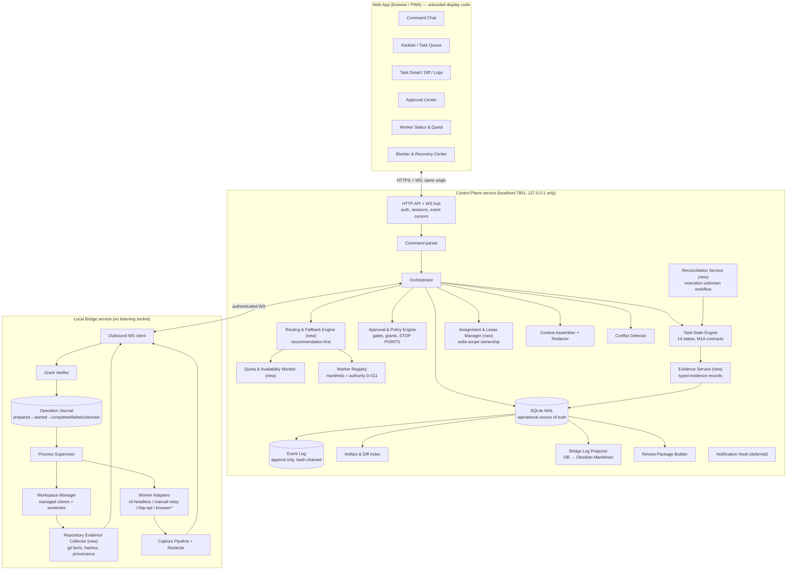
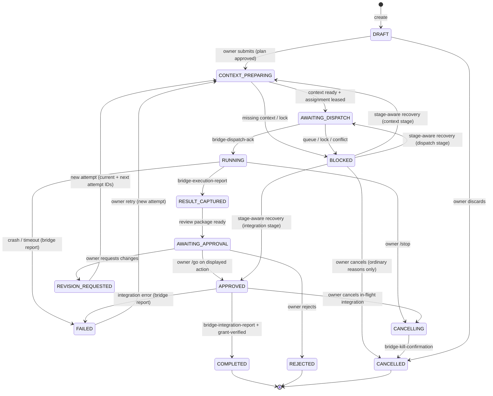
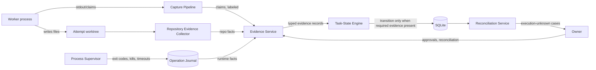
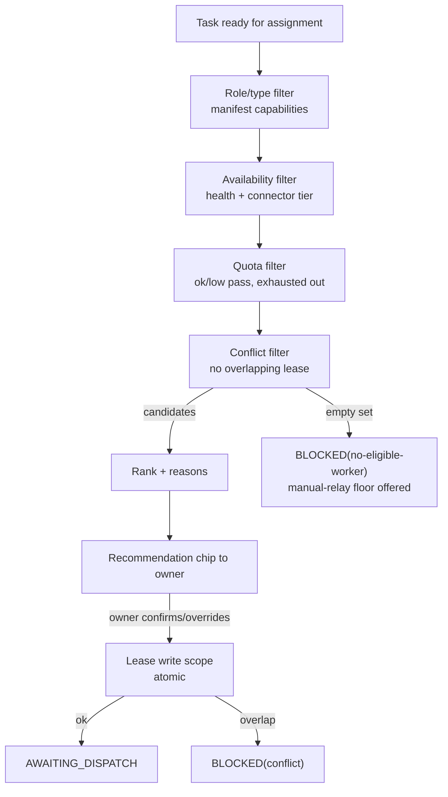
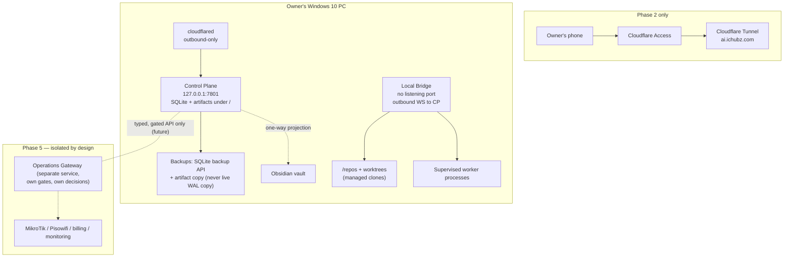

# CHUBZ AI Command Center — Overall Architecture Draft

> **STATUS: REVIEWED HISTORICAL / DESIGN-INPUT DOCUMENT — NOT INDEPENDENTLY AUTHORITATIVE. AUTHORIZES NOTHING.**
>
> When wording conflicts, [DECISIONS.md](../DECISIONS.md), [FINAL_ARCHITECTURE_DESIGN.md](../FINAL_ARCHITECTURE_DESIGN.md), [SECURITY_AND_THREAT_MODEL.md](../SECURITY_AND_THREAT_MODEL.md), and [PHASED_IMPLEMENTATION_PLAN.md](../PHASED_IMPLEMENTATION_PLAN.md) govern. Proposal dispositions are recorded in [BUNSO_ARCHITECTURE_ALIGNMENT.md](BUNSO_ARCHITECTURE_ALIGNMENT.md).
>
> Author: Claude Code / BUNSO (Fable 5), lead and final architecture designer per accepted decision D-005.
> Date: 2026-07-12. Baseline: `main` @ `bb8928b` (M1A Core Contracts merged); M1B Protocol Contracts under correction on `task/m1b-protocol-contracts` @ `078d24d`.
>
> **Relationship to existing documents.** This draft does not replace the owner-accepted baseline. [FINAL_ARCHITECTURE_DESIGN.md](../FINAL_ARCHITECTURE_DESIGN.md) (D-006…D-018), [SECURITY_AND_THREAT_MODEL.md](../SECURITY_AND_THREAT_MODEL.md), [PHASED_IMPLEMENTATION_PLAN.md](../PHASED_IMPLEMENTATION_PLAN.md), and [DECISIONS.md](../DECISIONS.md) (D-001…D-022) remain accepted and governing. This document is the **complete overall architecture**: it restates the accepted core normatively by reference, integrates the M1A hardening decisions (D-020, D-021, D-022), and adds the subsystems the owner has since required — Kanban/task-queue surfaces, automatic routing, quota-aware fallback, the evidence model, and Bridge/Obsidian memory integration — each labeled `ACCEPTED` (already decided) or `PROPOSED` (requires owner decision; enumerated in [OVERALL_ARCHITECTURE_GAP_AND_DECISION_REVIEW.md](OVERALL_ARCHITECTURE_GAP_AND_DECISION_REVIEW.md)). Where this draft and DECISIONS.md ever disagree, DECISIONS.md governs.

---

## 1. Product Boundary

### 1.1 What the CHUBZ AI Command Center IS

A **local-first, owner-gated orchestration system for AI workers** running on Kenneth's Windows PC, with a web interface usable locally (Phase 1) and remotely through Cloudflare Tunnel + Access (Phase 2). It:

- gives the owner **one command surface** (chat-first, with Kanban/task views layered on top) to create, dispatch, watch, review, approve, and deliver bounded tasks;
- runs the **Plan → Build → Review → Verify → Deliver** workflow with fourteen visible task states and explicit STOP POINTS;
- isolates every task attempt in its own Git worktree from a managed clone, never touching the owner's own working copy;
- captures diffs, logs, test results, blockers, and handoffs automatically;
- enforces every consequential action through typed approval gates and short-lived, single-use, action-hash-bound capability grants;
- treats worker output as **claims** and repository/runtime facts as **evidence** (§4);
- routes tasks by role, task type, availability, and quota, with safe fallback (§5) — recommendation-first, owner-confirmed;
- projects a persistent, human-readable memory into Bridge/Obsidian and can reconstruct exact state in a fresh session (§8).

### 1.2 What it is NOT

- **Not an autonomous agent swarm.** No worker triggers another worker without an owner-visible task and gate.
- **Not a production controller in any current phase.** Deploy, restart, migration, database writes, MikroTik/router, DNS, credential, and destructive-Git actions are **refused outright** in the MVP (D-015) — no executable code path exists for them.
- **Not a replacement for owner judgment.** `/compare`, review packages, and routing recommendations inform a human decision; the system never merges, deploys, or reassigns on its own initiative.
- **Not a multi-tenant SaaS.** One owner household by design; role fields exist for the future but MVP hardcodes owner-only.
- **Not a semantic-conflict resolver.** Overlap and risk are flagged, never auto-resolved (permanent non-goal).

### 1.3 MVP boundary (Phase 1)

One owner, one project, one Windows PC bridge, one CLI connector (Codex CLI per validated U-1) plus manual relay for all workers, the twelve-command chat, the fourteen-state task engine, capture/diff/test/review-package pipeline, one approval gate class with HMAC grants (loopback-only), Kanban and task-detail views, Bridge Log projection, emergency stop, and full crash/reconciliation recovery. Routing is **manual worker selection with a recommendation chip**; the routing engine executes nothing by itself in MVP.

### 1.4 Future platform boundary

The platform is designed so that the following can be added **without redesigning the core**: additional CLI/API adapters (Phase 3), higher concurrency with active conflict blocking (Phase 4), notifications, automatic routing with owner-approved auto-dispatch policies, remote access (Phase 2), multi-project portfolios, and — strictly through a separate, later-designed **Operations Gateway** (§12.6) — ISP, MikroTik, Pisowifi, billing, monitoring, device control, job orders, and business automation. Business-system control never runs inside the Command Center core process and never inherits `/go` authority; each operate-class capability requires its own gate design, typed confirmation, and owner decision (Phase 5, per accepted plan).

### 1.5 Outside the first implementation phase

Remote access and passkeys (Phase 2); worker privilege containment beyond supervision (Phase 2 prerequisite); adapters beyond Codex CLI (Phase 3); concurrency above 1/project–2/global (Phase 4); notifications, dashboards beyond the Kanban/status views, routing auto-dispatch, NSSM service packaging (Phase 4); every business integration (Phase 5).

---

## 2. System Architecture

### 2.1 Topology and components `ACCEPTED (D-006) + PROPOSED extensions`

The accepted two-service topology is preserved: a **Control Plane** (state, orchestration, gates, UI hosting; loopback-only) and an outbound-only **Local Bridge** (the sole component allowed to touch worker processes, project files, and Git). All new subsystems are placed inside these two services — no third service is introduced.



### 2.2 Component responsibilities

| Component | Responsibility | Never does |
|---|---|---|
| **Web/Desktop UI** (React PWA) | Rendering chat, Kanban, task detail, approval cards, live logs, diffs, worker/quota status, recovery center | Business logic, secrets, direct file/worker access; every command re-validated server-side |
| **Command Center API/backend** (Control Plane API + WS hub) | Auth, sessions, idempotency keys, event cursors, same-origin API for all UI surfaces | Listening on non-loopback interfaces (Phase 1); trusting client state |
| **Orchestrator** | Drives tasks through the lifecycle; sequences context → dispatch → capture → approval → integration; owns the queue | Bypassing the Approval & Policy Engine or Task-State Engine |
| **Task-State Engine** | The merged M1A contracts: 14 states, legal-transition table, transition actors, mandatory typed evidence, trusted task snapshot as a separate input (D-022 §1–2), trusted blocked context (D-021), stage-aware reconciliation (D-020/D-021) | Accepting a transition whose evidence, snapshot, or attempt identity is caller-supplied instead of store-loaded |
| **Worker/agent adapters** (Bridge) | Translate one dispatch into one worker invocation; normalize output; enforce timeout/cancel | Accessing files outside the attempt worktree; claiming provenance they cannot prove |
| **Connector layer** | The four connector types (`cli-headless`, `local-process`, `http-api`, `manual-relay`) plus deferred `browser-controlled`; per-worker manifests declare which | Representing manual relay as automated; running a browser-controlled connector without automated provenance (D-022 §6) |
| **Routing & Fallback Engine** `PROPOSED` | Scores eligible workers per task (role, task type, capability, availability, quota, current load) and produces a **ranked recommendation with reasons**; applies fallback ordering when the preferred worker is unavailable | Dispatching anything without the applicable approval; overriding owner selection; assigning two workers to one write scope |
| **Approval & Policy Engine** | Typed gates, approval cards, grant issuance/expiry, STOP POINT enforcement, refusal of high-risk categories (D-015) | Auto-approving; batching approvals; letting worker-authored text define an approval action |
| **Assignment & Lease Manager** `PROPOSED` | Task/branch/write-scope ownership records, leases with expiry, stale-lease recovery, handoff execution | Granting overlapping write scopes; silent reassignment |
| **Event/log stream** | Append-only, hash-chained event log in SQLite; WS fan-out with `last_event_id` cursor resync; live execution feed | Being edited in place; serving as a mutable state store |
| **Diff & artifact management** | Content-hashed artifact store with quota/retention; unified diffs; test reports; review packages | Storing unredacted content; silent pruning |
| **Project memory / Bridge / Obsidian** | One-way projection of DB truth into vault Markdown; session-bootstrap snapshot (§8) | Reading Markdown back as authoritative state (D-010) |
| **Repository Evidence Collector** `PROPOSED` (Bridge) | Produces signed-by-connection, typed repository facts: current branch, HEAD, `git status`, changed paths, diff hashes, worktree base commit, commit existence checks for reconciliation | Deriving facts from worker stdout; writing to any repository |
| **Quota & Availability Monitor** `PROPOSED` | Per-worker availability tier (auto/manual/offline), health checks per manifest, quota snapshots (adapter-reported where possible, owner-declared otherwise), exhaustion flags feeding routing | Guessing quota it cannot observe; hiding manual/degraded tiers |
| **Notification system** `DEFERRED (Phase 4)` | Outbound-only push/email on approval-needed, blocked, or completed events | Opening any inbound port |
| **Authentication & authorization** | Phase 1: Argon2 password + sessions on localhost; Phase 2: passkeys/WebAuthn + Cloudflare Access + Bridge-verified owner-presence approval proof (D-014) | Storing raw provider secrets in browser or DB plaintext |
| **Audit trail** | Every auth event, command, transition, approval, grant, dispatch, capture, reconciliation, and handoff as hash-chained audit events | Redaction bypass; in-place edits |
| **Data storage** | SQLite (WAL) operational truth + content-hashed filesystem artifact store, both under one data directory | Cloud state; copying the live WAL file for backup (use SQLite backup API) |
| **Recovery & Reconciliation services** | Startup reconciliation (DB vs Bridge journal vs repository state), `execution-unknown` owner workflow, stale-lease recovery, abandoned-task sweep | Blind retry of ambiguous operations; automated resolution of `execution-unknown` |

### 2.3 Communication flow

All UI surfaces speak only to the Control Plane API/WS (same origin). The Control Plane speaks to the Bridge only over the Bridge-originated authenticated WebSocket; every privileged instruction carries a capability grant. The Bridge speaks to workers only through adapters inside supervised processes pinned to the attempt worktree. Nothing else communicates: workers never reach the Control Plane, the UI never reaches the Bridge, and the Bridge never accepts inbound connections.

---

## 3. Task Lifecycle

### 3.1 The fourteen visible states `ACCEPTED (D-017 as corrected by D-020)`

`DRAFT`, `CONTEXT_PREPARING`, `AWAITING_DISPATCH`, `RUNNING`, `RESULT_CAPTURED`, `AWAITING_APPROVAL`, `REVISION_REQUESTED`, `APPROVED`, `COMPLETED`, `FAILED`, `BLOCKED`, `CANCELLING`, `CANCELLED`, `REJECTED` — exactly the merged `TASK_STATES` contract in `packages/shared`. "Waiting for worker" is a display substate of `RUNNING`; blocked reasons are machine-readable codes on `BLOCKED`, not extra states.



`BLOCKED(execution-unknown)` additionally exits only through owner reconciliation (§3.3). The full transition-authority and evidence table in FINAL_ARCHITECTURE_DESIGN.md §10 (as hardened by D-020/D-021/D-022 and merged in M1A) is normative; this draft adds no transition.

### 3.2 Lifecycle walk-through (user request → delivery)

1. **Task creation.** Owner creates a task in chat (`/codex …`, free text, or a Kanban "New task" form that produces the same typed command). Task enters `DRAFT` with an idempotency key.
2. **Planning.** For non-trivial tasks the first attempt is a *plan attempt* (worker capability `design`/`review`): the worker returns a plan, not code. The plan is displayed and its acceptance is an ordinary owner approval. `PROPOSED`: task category `plan-first` makes this mandatory for medium/high-risk categories.
3. **Approval to proceed (STOP POINT).** Owner submits → `CONTEXT_PREPARING`. Context Assembler builds the bounded, redacted prompt from approved context sources.
4. **Assignment.** Routing Engine recommends a worker (with reasons); owner confirms or overrides. Assignment & Lease Manager checks the write scope against active leases; conflict ⇒ `BLOCKED(conflict)`. On success it records the assignment + lease and the task enters `AWAITING_DISPATCH`.
5. **Execution.** Dispatch (with grant) → Bridge journals the operation, creates the worktree, launches the adapter → `RUNNING` on `bridge-dispatch-ack`. Live stdout/stderr streams to the UI (redacted).
6. **Review.** On worker exit, the Capture Pipeline + Repository Evidence Collector record response, changed files, diff, tests, provenance → `RESULT_CAPTURED` → `AWAITING_APPROVAL` with a review package. Independent review (Bantay via review package; Codex for BUNSO-authored code per D-019) happens here — review is a task-linked activity inside `AWAITING_APPROVAL`, not an extra state.
7. **Verification.** Test runs are bridge-supervised (runtime evidence). Worker-claimed results are displayed as claims and never satisfy verification.
8. **Failure handling.** Crash/timeout → `FAILED` with partial capture flagged. Retry after **confirmed** failure requires owner action and a new immutable attempt.
9. **Blocking.** Any stage can block with a reason code; the trusted blocked context (source state, operation, attempt ID, operation ID, journal ref) is preserved store-side (D-021) and cannot be substituted by any request (D-022).
10. **Retry / new attempt.** `FAILED`/`REVISION_REQUESTED` → `CONTEXT_PREPARING` with **both** the trusted current attempt ID and a distinct proposed next attempt ID (D-022 §4). Previous attempts stay immutable.
11. **Worker handoff.** Owner-visible: new assignment proposal → lease transfer (old lease released, new leased) → handoff record with context bundle (§5.6). Never silent.
12. **Pause/resume.** Pause = owner moves the task to `BLOCKED(policy: paused)` from a passive state, or `/stop`s a running attempt (the attempt ends; resume creates a new attempt). Queue-level pause exists via emergency stop level 2.
13. **Cancellation.** Passive states → `CANCELLED` directly (owner only); in-flight states via `CANCELLING` with bridge kill confirmation (D-020). `BLOCKED(execution-unknown)` cannot be cancelled until reconciled.
14. **Delivery.** `/go` on the displayed action → `APPROVED` → Bridge finalizes an approved task commit + exported patch **in the managed repository only** → `COMPLETED`. Applying to the owner's real project is the separate gated M9 action.
15. **Final owner approval.** `/go` is always the owner's; nothing delivers without it.
16. **Recovery after interruption.** On Control Plane restart: WAL recovery + journal reconciliation. On Bridge restart: orphan process kill + journal reconciliation against actual repository state (Repository Evidence Collector); provable outcomes complete normally, ambiguous ones become `BLOCKED(execution-unknown)` for the owner-only workflow in §3.3.

### 3.3 Execution-unknown reconciliation `ACCEPTED (D-020/D-021/D-022)`

The one lifecycle path that is owner-only end-to-end. Outcomes resolve the **original operation**, never the whole task:

| Outcome | Requires | Result |
|---|---|---|
| `confirmed-completed` | Owner reconciliation + the operation's own success evidence (dispatch → `bridge-dispatch-ack`; execution → `bridge-execution-report`; integration → `bridge-integration-report` + `grant-verified`) | Operation's legitimate success state (RUNNING / RESULT_CAPTURED / COMPLETED) |
| `confirmed-failed` | Owner reconciliation **+ stage-specific trusted Bridge failure/result evidence** (D-022 §5 — owner say-so alone is never sufficient) | FAILED |
| `confirmed-not-executed` | Owner reconciliation; new operation identity (and new attempt identity for the execution stage) | Operation's start state (AWAITING_DISPATCH / CONTEXT_PREPARING / APPROVED) |

---

## 4. Trust and Evidence Model

### 4.1 Evidence classes, ranked

1. **Owner approvals / attestations** — recorded decisions (`/go`, reconciliation outcomes, manual-relay attestation). Highest authority but deliberately narrow: an owner attestation never substitutes for required Bridge evidence on `confirmed-failed` (D-022 §5), and manual-relay attestation confers text-level provenance only.
2. **Repository-derived evidence** — facts the Repository Evidence Collector reads from Git itself (branch, HEAD, status, diff hashes, commit existence). Trumps every claim about code state.
3. **Runtime-derived evidence** — Bridge-supervised facts: dispatch acks, execution reports, exit codes, kill confirmations, journal states, test-run outputs, grant verifications.
4. **Automated provenance** — connector type, executable path/version/hash for automated connectors; **mandatory for any future browser-controlled connector** (D-022 §6). Owner-attested provenance is reserved exclusively for manual relay/import.
5. **Reconciliation evidence** — owner reconciliation records *combined with* stage evidence; exists only for `execution-unknown`.
6. **Worker-reported claims** — everything a worker says (including "tests pass", "I changed X", "done"). Displayed, stored, and **never sufficient for any state transition, verification, or ownership fact.**

### 4.2 Trusted source per fact

| Fact | Trusted source | Explicitly NOT trusted |
|---|---|---|
| Current branch / commit | Repository Evidence Collector (`git rev-parse`, `git branch` in the managed clone/worktree) | Worker stdout; UI state; stale docs |
| Changed files / diff | Capture Pipeline `git status`/`git diff` in the attempt worktree, content-hashed | Worker-claimed file lists |
| Worker ownership | Assignment + lease records in the Control Plane store; manifest identity | A worker asserting it owns a task/scope |
| Task status | Task-State Engine over SQLite — the single authority; loaded as the trusted snapshot input (D-022 §1) | Bridge Log Markdown; transition-request payloads; worker claims |
| Test results | Bridge-supervised test runs (command, exit code, parsed report) | Worker-claimed results (shown as claims) |
| Failure confirmation | Stage-specific Bridge evidence (+ owner reconciliation for execution-unknown) | Owner reconciliation alone; worker claims; timeouts inferred by the UI |
| Browser-controlled activity | Automated provenance (session recording/DOM action log/har-level capture — to be designed before any such connector exists) | Owner attestation (that is manual relay, and must be labeled as such) |
| Deployment state | MVP: no trusted source exists because no deploy path exists (D-015). Future: runtime probes by the Operations Gateway + owner GO records | Worker claims; assumption from an approved task |
| Production state | Same as deployment: future Operations Gateway read-only probes only | Anything else |
| Handoff completion | Handoff record + old lease released + new lease active + repository evidence that the outgoing attempt is finalized/archived | Either worker's statement that handoff happened |

### 4.3 Evidence and reconciliation flow



---

## 5. Multi-Agent Routing `PROPOSED — new subsystem, owner decision OD-2`

### 5.1 Principles

Routing is **recommendation-first**: the engine ranks eligible workers and explains why; the owner confirms (one tap) or overrides. Auto-dispatch without per-task confirmation is a separate, later, owner-approved policy limited to explicitly listed low-risk categories — never default behavior. Routing never bypasses gates, leases, or the concurrency limits (D-016).

### 5.2 Worker capability registry

The worker manifests (D-011, schema merged in M1A) are the capability registry. Routing consumes, per worker: `capabilities`, `restrictions`, `allowedTaskCategories`, `defaultRiskLevel`, connector tier, and health/quota state. Nothing in routing names a specific worker in code (D-004).

### 5.3 Routing inputs and algorithm

For a task with `category`, `riskLevel`, and `writeScope`:

1. **Role/task-type filter** — workers whose manifest allows the category and whose restrictions don't forbid it (e.g., Bantay: `never-write` ⇒ review tasks only; Opus-in-Antigravity: `assigned-only` ⇒ excluded unless owner names it).
2. **Availability filter** — Quota & Availability Monitor tier must be `auto:ready` or `manual:ready`; `offline`/`unhealthy` excluded.
3. **Quota filter** — workers flagged quota-exhausted are excluded from recommendation (still selectable by owner override, clearly flagged).
4. **Conflict filter** — workers already holding a lease overlapping the task's write scope are excluded (a worker may hold many read tasks but one write scope conversation at a time; D-019's "never the same files concurrently" generalizes to all worker pairs).
5. **Ranking** — remaining workers ordered by: preferred-role match > connector tier (automated over manual) > current load (fewest active assignments) > historical success on the category (advisory only).
6. **Output** — ranked list with machine-readable reasons, surfaced as a recommendation chip on the task.

### 5.4 Quota-aware fallback

Quota state per worker: `ok`, `low`, `exhausted`, `unknown`. Sources: adapter/health-check where a programmatic signal exists; **owner-declared** otherwise (a one-tap "Fable quota exhausted" toggle — honest, since most quotas are not programmatically observable). On `exhausted`: the worker drops out of recommendations, in-flight attempts finish normally, and queued assignments to it are re-recommended. The standing example is D-019 itself: BUNSO/Fable 5 primary while quota lasts, Codex as fallback — the engine encodes exactly this pattern generically.

### 5.5 When every preferred worker is unavailable

The task does **not** silently degrade. It enters `BLOCKED(no-eligible-worker)` (new ordinary reason code, `PROPOSED`) with a card listing: which workers were filtered and why, the manual-relay option (always available for every worker per D-012), and an owner-override option. Manual relay is the universal floor — the system is never dead-ended, only slower and honestly labeled.

### 5.6 Context preservation during handoff

A handoff bundles, from store-side truth (never from the outgoing worker's memory): the original request, accepted plan, all attempt records with diffs and evidence, current blocked context if any, the assembled context sources, and open review findings. The incoming worker receives this bundle as its context; the handoff record links both assignments. Lease transfer is atomic: release + acquire in one transaction, owner-visible.

### 5.7 Conflicting-assignment prevention

Structural, not advisory: the Assignment & Lease Manager refuses any assignment whose write scope overlaps an active lease (§6), and routing filters such workers out before recommendation. Two workers can never hold overlapping write scopes regardless of how the assignment was initiated.



---

## 6. Task Isolation and Concurrency

### 6.1 Ownership hierarchy

- **Project ownership**: every project has one owner (Kenneth; multi-owner out of scope). Projects enroll as managed clones (D-009); the original directory is never a write target.
- **Task ownership**: exactly one assigned worker per active attempt. Recorded as an Assignment; visible everywhere the task is shown.
- **Branch ownership**: each attempt owns branch `task/<id>` (attempt-suffixed worktrees) in the managed repository. No two attempts share a live worktree.
- **File/write-scope ownership**: an Assignment carries a **write scope** — a set of path globs within one project. The lease on that scope is the enforcement object.

### 6.2 Leases `PROPOSED`

A lease = (worker, project, write scope, task, attempt, issuedAt, expiresAt, heartbeat). Rules:

- Acquired atomically at assignment; refused on any overlap with an active lease (glob-intersection check; ambiguous overlaps count as overlap).
- **Expiry**: leases have a TTL (default 24 h for automated workers, 7 days for manual-relay assignments) renewed by activity (dispatch, capture, owner action on the task).
- **Stale-ownership recovery**: an expired lease does not silently vanish — the task is flagged `BLOCKED(stale-lease)` (`PROPOSED` reason code) and the owner chooses: renew (same worker), handoff (§5.6), or cancel. Repository evidence shows whether the stale attempt left uncommitted work in its worktree before the owner decides.
- Emergency stop level 2+ freezes lease issuance.

### 6.3 Concurrency rules `ACCEPTED (D-016)`

Max 1 RUNNING task per project, 2 system-wide; per-project integration lock (one finalization at a time); FIFO queue with owner reordering. Raises only in Phase 4 with the Conflict Detector actively blocking colliding finalizations.

**Read-only parallel work is unrestricted**: review tasks, plan attempts, and `/compare` fan-outs read the same base commit freely; only write scopes are leased. `/compare` creates N worktrees but at most one result is ever approved for integration.

### 6.4 Same-file protection (the D-019 rule, generalized)

No two workers may modify the same files concurrently, ever: (a) routing filters conflicting workers out; (b) lease acquisition refuses overlap; (c) the Conflict Detector compares changed-path sets of open attempts and blocks the later integration on overlap; (d) capture flags out-of-scope writes and blocks integration (AP-4). Four independent layers; the first two are preventive, the last two detective.

---

## 7. Safety and Approval Architecture

### 7.1 Gate map

| Action | Gate | Mechanism |
|---|---|---|
| Planning (plan attempt dispatch) | read | Grant scoped to context read |
| Code changes (worker execution) | read + workspace-write | Grant pinned to the attempt worktree |
| Result integration (managed repo commit + patch) | integrate | `/go` on the displayed action → single-use action-hash grant |
| Apply to owner's real project | apply (separate) | M9's own displayed bounded action + approval card — never part of `/go` on the task |
| Sensitive files (denylisted paths: `.env*`, keys, credential stores) | refused as context or capture content | Context denylist + dual-layer redaction; not gate-able, structurally excluded |
| Database migrations (of managed business systems) | **refused in MVP** (D-015) | No code path; future Operations Gateway design required |
| Production changes / deployments / restarts | **refused in MVP** (D-015) | Same |
| Router/network (MikroTik, DNS, tunnel) | **refused in MVP** (D-015) | Same |
| Destructive operations (force-push, history rewrite, workspace delete beyond retention) | refused (Git-destructive) / dispose gate (workspace pruning) | D-015; pruning is an explicit owner action |
| Retry after confirmed failure | owner-only new attempt | New attempt identity required (D-022 §4) |
| Worker reassignment / handoff | owner approval | Lease transfer + handoff record (§5.6) |
| Scope expansion (write scope grows) | owner approval | New lease negotiation; old lease unchanged until approved |
| Routing auto-dispatch policy (future) | owner decision per category | Policy record; revocable; never default |

### 7.2 STOP POINT behavior

A STOP POINT is a **structural halt, not a convention**: the Orchestrator has no transition available that crosses it without a recorded owner decision. Concretely: `DRAFT→CONTEXT_PREPARING` (owner submits), `AWAITING_APPROVAL→APPROVED/REJECTED/REVISION_REQUESTED` (owner verdict), every `BLOCKED(execution-unknown)` exit (owner reconciliation), lease transfer (owner), milestone/phase gates in the roadmap (owner GO recorded in DECISIONS.md or ACTIVE_TASKS.md). `/go` approves exactly one displayed action; with more than one pending action `/go` is an error (never batches). Grants expire ≤10 min, are single-use, action-hash-bound, and consumed in the Bridge journal **before** privileged execution.

### 7.3 Emergency stop

Level 1: cancel current task (tree-kill). Level 2: revoke all outstanding grants + pause dispatch queue + freeze lease issuance. Level 3: Bridge exits its supervisor loop. Always visible in every UI surface; requires one confirm tap; never gated.

---

## 8. Memory and Source of Truth

### 8.1 Authority `ACCEPTED (D-010)`

SQLite is the operational source of truth. The Bridge/Obsidian vault is a **regenerable projection** — never read back as state. Hand-edits to generated files are overwritten; owner commentary lives in separate linked notes.

### 8.2 Canonical records and their projections

| Canonical record (DB) | Obsidian projection |
|---|---|
| Task + attempts + evidence | One file per task: `BridgeLog/<project>/YYYY/MM/YYYY-MM-DD--task-<id>--<slug>.md` (frontmatter: state, worker, attempts, risk flags, approvals, links) |
| Decision log | `DECISIONS.md` in the repo remains the decision authority (append-only prose); a `Decisions/` vault index projects it for linking `PROPOSED` |
| Handoff log | Handoff records project into the task file + a `Handoffs/` monthly index `PROPOSED` |
| Worker report | Worker responses stored as artifacts; task file links them; claims labeled as claims |
| Repository evidence | Evidence records referenced in the task file (branch, HEAD, diff hash) — projected values carry their `recordedAt` timestamp |
| Approval evidence | Approval decisions with action hashes in the task file frontmatter |
| Current project snapshot | `_SNAPSHOT.md` per project `PROPOSED` — see §8.3 |

### 8.3 Session bootstrap — how a new session reconstructs exact state `PROPOSED`

A new worker/architect session must not depend on conversational memory. The Control Plane maintains a **projected snapshot** (`_SNAPSHOT.md` per project + a repo-level `docs/ACTIVE_TASKS.md` alignment) containing: current milestone and its authorization state, per-task state + attempt + assignee + lease, open blockers with reason codes, pending approvals, last N decisions, and — critically — the **repository evidence header**: branch, HEAD, and dirty-flag *as of projection time*, so a reader can verify staleness with one `git rev-parse`. Reconstruction procedure: (1) read snapshot, (2) verify its evidence header against live Git, (3) on mismatch, trust Git + DB and flag the snapshot stale. Until the system exists, the manual equivalent is exactly what this session did: DECISIONS.md → ACTIVE_TASKS.md → git evidence, in that order, with discrepancies flagged (see gap review G-1…G-4).

### 8.4 Conflict detection, reconciliation, stale records

- **DB vs repository**: startup and on-demand reconciliation compares journaled operations against actual Git state (commit/branch existence + hash match); mismatches → `execution-unknown` workflow.
- **DB vs vault**: one-way projection makes conflict impossible by construction; a projection checksum per file detects hand-edits, which are reported then overwritten.
- **Docs vs reality** (the class of staleness found in this review): status assertions in prose documents must carry an evidence header (commit hash + date). The gap review proposes a doc-alignment task; architecturally, once ACTIVE_TASKS.md becomes a projection (post-M8), this staleness class disappears.

---

## 9. Data Model (conceptual)

Extends the accepted §11 model; SQLite, WAL, one file; artifacts on disk content-hashed. New entities marked ●.

```mermaid
erDiagram
    PROJECT ||--o{ TASK : contains
    PROJECT ||--o{ ENVIRONMENT : "declares ●"
    TASK ||--o{ TASK_ATTEMPT : has
    TASK ||--o{ ASSIGNMENT : "assigned via ●"
    ASSIGNMENT ||--|| WRITE_SCOPE : "bounds ●"
    ASSIGNMENT ||--o| LEASE : "enforced by ●"
    ASSIGNMENT }o--|| WORKER : names
    WORKER ||--o{ WORKER_CAPABILITY : declares
    WORKER ||--|| CONNECTOR : uses
    WORKER ||--o{ QUOTA_SNAPSHOT : "reports ●"
    TASK_ATTEMPT ||--o{ EVIDENCE : "corroborated by ●"
    TASK_ATTEMPT ||--o{ ARTIFACT : produced
    TASK_ATTEMPT ||--o| DIFF : generated
    TASK_ATTEMPT ||--o{ TEST_RESULT : executed
    TASK ||--o{ APPROVAL : raises
    APPROVAL ||--o| CAPABILITY_GRANT : issues
    TASK ||--o{ BLOCKER : "records ●"
    BLOCKER ||--o| RECONCILIATION : "resolved by ●"
    TASK ||--o{ HANDOFF : "transfers ●"
    HANDOFF }o--|| ASSIGNMENT : from
    HANDOFF }o--|| ASSIGNMENT : to
    PROJECT ||--o{ DECISION : "governed by ●"
    TASK ||--o{ EVENT : logged
    ENVIRONMENT ||--o{ PRODUCTION_ACTION : "future, refused in MVP ●"
```

| Entity | Purpose / key conceptual fields |
|---|---|
| **Project** | Enrolled managed clone; root path, git flag, vault path, lock state |
| **Task** | Request, category, risk level, state (14), current attempt ref, idempotency key |
| **Task attempt** | Immutable once past RUNNING; seq, prompt, worker, workspace ref, outcome |
| **Worker** | Manifest snapshot (authoritative, D-011), enabled flag |
| **Worker capability** | capability + restrictions from manifest |
| **Assignment ●** | task, attempt, worker, write scope, status (proposed/active/released/handed-off) |
| **Write scope ●** | project + path globs; the unit of exclusivity |
| **Lock/Lease ●** | scope lease: TTL, heartbeat, expiry handling (§6.2); plus per-project integration lock |
| **Approval** | request (gate, bounded-action text + action hash, expiry) + decision (verdict, decider, timestamp) |
| **Evidence ●** | typed record: class (owner/repo/runtime/provenance/reconciliation/claim), kind (e.g. `bridge-dispatch-ack`), payload, source, hash — the currency of the Task-State Engine |
| **Artifact** | content-hashed blob ref (responses, files, packages), quota/retention fields |
| **Diff** | unified diff ref + stats per attempt |
| **Test/verification result** | command, exit code, parsed summary, report ref; bridge-supervised flag |
| **Blocker ●** | reason code, trusted blocked context (source state, operation, attempt ID, operation ID, journal ref — D-021), entered/exited |
| **Handoff ●** | from/to assignment, context bundle ref, owner approval ref |
| **Decision ●** | D-number, status, text ref — DECISIONS.md remains the prose authority; the table indexes it |
| **Event log** | append-only, hash-chained; every command/transition/approval/dispatch/capture |
| **Quota snapshot ●** | worker, ts, state (ok/low/exhausted/unknown), source (adapter/owner-declared) |
| **Connector** | type, invocation config, timeout, cancelable, provenance mode (automated/owner-attested) |
| **Environment ●** | conceptual placeholder: local / staging / production descriptors for future Operations Gateway; MVP contains records only for the local dev environment |
| **Production action ●** | future entity, intentionally modeled now so refusal is checkable: category, environment, required gate design ref; **no executable path in MVP** (D-015) |

---

## 10. API and Event Boundaries

Same-origin HTTP + WS on the Control Plane. All mutating commands carry client idempotency keys (M1B envelopes); replays return the original result. "Owner gate" means an owner approval/decision is structurally required, not merely a UI confirm.

| API group | Representative operations | Idempotent commands | Owner gate |
|---|---|---|---|
| Projects | enroll, refresh managed clone, configure context sources, archive | enroll, refresh | enroll (paths), context-source approval |
| Tasks | create, submit, cancel, pause, reorder queue | create, submit, cancel | submit; cancel of in-flight states |
| Attempts | retry (new attempt), inspect | retry | retry (owner-only; current + next attempt IDs) |
| Workers | register/enable manifest, health, quota declare | manifest changes | enable/disable; quota declaration is owner action |
| Assignments | propose (routing), confirm, override, release | confirm, release | confirm/override |
| Approvals | list pending, decide (`/go`/reject/revision) | decide (idempotency + action hash) | every decision IS the gate |
| Evidence | list per task/attempt, verify hash | — (read-mostly; writes are internal) | n/a |
| Artifacts | list, download, prune | prune | prune (dispose gate) |
| Handoffs | propose, approve, bundle download | propose, approve | approve |
| Locks/Leases | list, renew, recover-stale | renew, recover | stale recovery choice |
| Quotas | snapshots, declare state | declare | declare is owner action |
| Events | cursor-based stream, audit export | — | n/a |
| Reconciliation | list execution-unknown, record outcome | record outcome | **owner-only, always** |
| Integrations | Bridge Log projector config, notification hook config (Phase 4) | config changes | config changes |

Internal event stream (WS fan-out + append-only log): `task.transitioned`, `attempt.captured`, `approval.requested/decided`, `grant.issued/consumed/expired`, `dispatch.acked`, `execution.reported`, `blocker.entered/exited`, `reconciliation.recorded`, `lease.acquired/released/expired`, `handoff.completed`, `quota.changed`, `bridge.connected/disconnected`, `emergency.stop`. Clients resync via `last_event_id`.

---

## 11. Interface Architecture

Chat remains the **command and approval surface** (D-002); the screens below are added **inspection surfaces** over the same store. Any action initiated from a non-chat screen produces the same typed command + approval card as chat — no second command path. (Owner decision OD-1 covers this UI evolution; see gap review.)

| Screen | Minimum visible information |
|---|---|
| **Executive dashboard** | Per project: tasks by state (14-state rollup), pending approvals count, blockers needing owner action, worker availability strip, quota flags, last delivery; one-tap jump to Approval Center and Recovery Center |
| **Kanban / task queue** | Columns grouping the 14 states (Backlog: DRAFT · Preparing: CONTEXT_PREPARING, AWAITING_DISPATCH · Working: RUNNING, CANCELLING · Attention: BLOCKED, FAILED · Review: RESULT_CAPTURED, AWAITING_APPROVAL, REVISION_REQUESTED · Integrating: APPROVED · Done: COMPLETED, REJECTED, CANCELLED); each card: exact state badge, worker + connector tier, attempt #, age, risk level, blocker reason if any; drag limited to legal owner transitions (anything else opens the proper command) |
| **Task detail** | State timeline with evidence per transition, attempts (immutable history), prompt + context sources, assignment/lease, diff stats, test verdicts, approvals with action hashes, blockers, handoffs, review package download |
| **Worker status** | Per worker: manifest identity, capabilities/restrictions, connector tier **honestly labeled** (automated vs owner-attested manual), health, quota state + source, active assignments, queue depth |
| **Approval center** | Every pending approval card: exact bounded action text (Control-Plane-derived, never worker-authored), gate type, action hash, diff stats, test verdict, expiry countdown, Go/Reject/Revision; one-at-a-time focus (`/go` semantics preserved) |
| **Live execution / log view** | Streaming redacted stdout/stderr per running attempt, elapsed vs timeout, supervisor status, cancel button |
| **Diff & artifact review** | Changed-file tree, unified diff viewer, out-of-scope-write flags, artifact list with hashes, review-package builder |
| **Project memory / history** | Task history with filters, Bridge Log links, decision index, handoff log, session-bootstrap snapshot view |
| **Blocker & recovery center** | All BLOCKED tasks grouped by reason code; for `execution-unknown`: the trusted blocked context, available evidence, and the three reconciliation outcomes with their evidence requirements; stale-lease recovery choices |
| **Settings / connectors** | Project paths, context sources + denylist, vault path, worker manifests, connector configs, device/session management, bridge enrollment, retention/quota settings |
| **Quota & availability dashboard** | Per worker quota timeline (snapshots + source), availability history, fallback order preview ("if X exhausts, tasks of category Y route to Z") |

Phone (PWA): single column; Kanban collapses to a state-grouped list; approval cards and emergency stop keep first-class prominence.

---

## 12. Deployment Architecture

### 12.1 Topology `ACCEPTED (D-006, D-008)`



### 12.2 Local-first vs hosted

Everything stateful is local (D-001). The only cloud elements are the Phase 2 doorway (Cloudflare Access + Tunnel) — no cloud datastore, no hosted control plane. Fallbacks (Tailscale, owner-run relay) stay as documented in the accepted design §5.1.

### 12.3 Windows compatibility and background services

Node.js LTS services; Phase 1 runs via `pnpm` scripts in two terminals; Phase 4 packages both services under NSSM (or Task Scheduler) for auto-start. Process control uses `execa` + `taskkill /T /F` semantics; privilege containment (restricted worker account, NTFS ACLs, Job Objects) is a hard Phase 2 prerequisite, not an MVP feature.

### 12.4 Data, secrets, backups, recovery

- **Database**: SQLite WAL, conceptually one operational store; PostgreSQL only if a multi-user future ever arrives.
- **Secrets**: bridge credential + grant-signing key in Windows DPAPI; provider secrets stay inside worker CLIs and never enter the data path; context denylist keeps them out of prompts/captures.
- **Backups**: SQLite backup API (`VACUUM INTO`) + artifact directory copy on a schedule (Phase 4 automation); restore drill is a Phase 4 acceptance criterion.
- **Recovery**: WAL recovery + dual-journal reconciliation on startup (§3.2 step 16); the Bridge can crash without losing task history; the Control Plane can restart without re-executing commands.

### 12.5 Development / staging / production separation

For the Command Center itself: development happens on task branches in this repo with the same review gates it will one day enforce; "staging" is a second data directory + port profile (`--profile staging`) on the same PC `PROPOSED`; "production" is the owner's live profile. For **managed business systems**: the Environment entity models local/staging/production descriptors, but the MVP has no execution path to any of them (D-015).

### 12.6 ISP/MikroTik isolation

Future business integrations run in a **separate Operations Gateway service** with its own process, credentials, decision records, gate designs, and typed confirmations. The Command Center core reaches it only through a typed, gated API; the Gateway never shares the core's database write access; a Command Center compromise must not imply router/billing control and vice versa. Nothing in Phases 0–4 builds any of this.

---

## 13. Implementation Roadmap

Ordering matches the required evaluation sequence (contracts → data model → state engine → evidence → registry/adapters → assignment/isolation → approval/safety → routing/quota → Kanban UI → live streaming → Bridge/Obsidian → packaging → external integrations), reconciled with the accepted M1–M9 plan. Repository evidence justifying deviations: M1A is merged; M1B is mid-review; the accepted plan already sequences M2–M9 correctly against this ordering, so accepted milestone numbers are preserved and new work is added as M1F, M10, M11.

Every milestone: Bantay review of the diff + owner GO recorded before the next begins. **Recommended worker** follows D-019: Codex as primary implementer (Fable 5 quota assumed ending with this session), Bantay review, Antigravity operational validation, BUNSO design authority only.

| # | Milestone | Objective | Depends on | Risk | Worker |
|---|---|---|---|---|---|
| M1B-fin | Finish M1B protocol contracts | Land the R2 public export-boundary patch; pass review; merge | M1A | Low | Current M1B holder → Codex on handoff |
| M1C | Approval-security contracts | Grant schemas, canonical action hash, replay/expiry model, Phase 2 approval-proof contracts | M1B | Low | Codex |
| M1D | Redaction library | Denylist, pattern + entropy detectors, corpus tests | none (parallel-safe read-only, but sequenced per one-task-at-a-time rule) | Low | Codex |
| M1E | Capture & projection contracts | Capture records + provenance fields, artifact metadata, Bridge Log frontmatter, review-package manifest | M1B | Low | Codex |
| M1F ● | Coordination contracts `PROPOSED` | Schemas for Assignment, WriteScope, Lease, Handoff, QuotaSnapshot, Evidence taxonomy, routing policy, blocked-reason additions (`no-eligible-worker`, `stale-lease`) | M1A–M1E | Low | Codex |
| M2 | Control-plane skeleton | Fastify loopback, SQLite + migrations (canonical data model §9), auth, WS hub + cursors, event log | M1A–M1F | Med | Codex |
| M3 | Bridge foundation | Enrollment + DPAPI, operation journal, supervisor, managed clone/worktrees, **Repository Evidence Collector** | M2 | Med-High | Codex |
| M4 | State engine live + grants E2E | Orchestrator + Task-State Engine over the store, approval engine + HMAC grants, echo worker, assignment/lease enforcement, reconciliation workflow | M2, M3 | High | Codex |
| M5 | Registry + first adapters | Worker registry from manifests, Codex CLI adapter (U-1), manual-relay adapter with owner-attested import | M4 | Med | Codex |
| M6 | Web app core | Chat + approval cards + relay cards, Kanban, task detail, worker status; CSP/sanitized rendering from the start | M4 (echo), M5 | Med | Codex |
| M7 | Capture/diff/review | Capture pipeline + second-layer redaction, diff/artifact review UI, review packages, live log streaming | M5, M6 | Med | Codex |
| M8 | Memory + safety close-out | Bridge Log projector, session-bootstrap snapshot, emergency stop levels 1–3, blocker/recovery center, hardening pass | M7 | Med | Codex |
| M9 | Apply-to-project (separately gated) | The explicit apply/cherry-pick/export action into the owner's real project, own approval card | M8 + owner choice | High | Codex |
| M10 ● | Routing & quota `PROPOSED` | Routing & Fallback Engine (recommendation-first), Quota & Availability Monitor, quota dashboard | M5, M8; owner decision OD-2 | Med | Codex |
| M11 ● | Dashboards + notifications + packaging `PROPOSED` (Phase 4) | Executive dashboard, notification hook (outbound-only), NSSM packaging, backup automation | M10 | Med | Codex + Antigravity |
| P2 | Remote access (Phase 2, unchanged) | Passkeys, owner-presence approval proof, privilege containment, Cloudflare runbook, §18 checklist | Phase 1 demo accepted | High | Codex + Antigravity + Bantay (blocking) |
| P3–P5 | Adapters → concurrency → business integrations | Per accepted plan; each Phase 5 item gets its own design cycle | P2 | Per item | Future assignment |

**Per-milestone contract (applies to every row):** exact scope = the named components only; acceptance = tests green + Bantay review recorded + live demo where runnable; tests = unit/contract for M1*-rows, integration + Playwright from M4 on; out-of-scope = everything not named, and always: deploy/production/network actions; approval gate = explicit owner GO recorded before the next milestone dispatches. Foundation correctness (M1B-fin…M4) strictly precedes visual features (M6 onward can overlap only after M4 is accepted).

---

## 14. Gap and Conflict Review

Maintained as a separate document so it can be updated without touching this draft: **[OVERALL_ARCHITECTURE_GAP_AND_DECISION_REVIEW.md](OVERALL_ARCHITECTURE_GAP_AND_DECISION_REVIEW.md)** — stale wording found in the repository, contradictions between documents, contracts to freeze, redesign risks, and the full owner-decision list (OD-1…OD-8). No major product decision in this draft is silently made: everything new is `PROPOSED` and enumerated there.

---

*This draft authorizes no implementation. Next actions in order: complete M1B (R2 patch) under its existing authorization; Bantay review of this draft; owner decisions OD-1…OD-8; then M1C under its own GO.*
